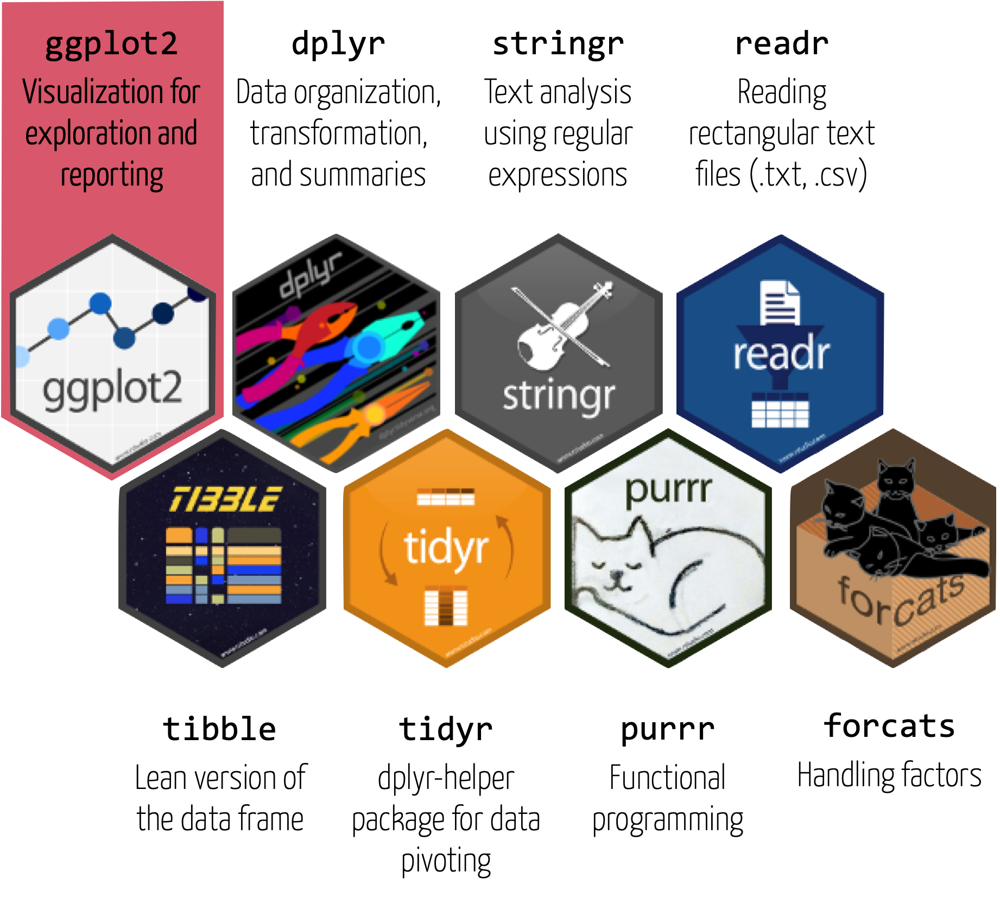

layout: true

<div class="my-footer">
  <span style="text-align:center">
    <span> 
      
    </span>
    <a href="https://therbootcamp.github.io/">
      <span style="padding-left:82px"> 
        <font color="#7E7E7E">
          https://therbootcamp.github.io
        </font>
      </span>
    </a>
    <a href="https://therbootcamp.github.io/">
      <font color="#7E7E7E">
      The R Bootcamp | June 2024
      </font>
    </a>
    </span>
  </div> 

---


```{r, eval = TRUE, echo = FALSE, warning=F,message=F}
# Code to knit slides
baselers <- readr::read_csv("1_Data/basel.csv")
```


```{r setup, include=FALSE}
options(htmltools.dir.version = FALSE)
# see: https://github.com/yihui/xaringan
# install.packages("xaringan")
# see: 
# https://github.com/yihui/xaringan/wiki
# https://github.com/gnab/remark/wiki/Markdown
options(width=110)
options(digits = 4)
```

```{r, echo = FALSE ,message = FALSE, warning = FALSE}
knitr::opts_chunk$set(comment=NA, fig.width=6, fig.height=6, echo = TRUE, eval = TRUE, 
                      message = FALSE, warning = FALSE, fig.align = 'center', dpi = 200)
library(tidyverse)
library(ggthemes)
basel = read_csv('1_Data/taxation.csv')
```


.pull-left3[

# Tidyverse

<ul>
  <li class="m1"><span>The tidyverse is ...</span></li><br>
  <ul class="level">
    <li><span>A collection of user-friendly <high>packages</high> for analyzing <high>tidy data</high></span></li><br>
    <li><span>An <high>ecosystem</high> for analytics and data science with common design principles</span></li><br>
    <li><span>A <high>dialect</high> of the R language</span></li>
  </ul>
</ul>

]

.pull-right65[
<br><br>
<p align="center">

</p>
]

---

# Modular graphics in <mono>ggplot2</mono>

.pull-left45[

<ul>
  <li class="m1"><span><highm>data</highm>: the data set</span></li>
  <li class="m2"><span><highm>mapping</highm>: the plot's structure</span></li>
  <ul class="level">
    <li><span>What do the axes represent?</span></li>
    <li><span>What do size, shapes, colors, etc. represent?</span></li>
  </ul>
  <li class="m3"><span><highm>geoms</highm>: geometric shapes illustrating data</high></span></li>
  <li class="m4"><span><highm>facets</highm>: Stratify plot according to variable</high></span></li>
  <li class="m5"><span><highm>labs</highm>: Plot annotation</high></span></li>
  <li class="m6"><span><highm>themes</highm>: Aesthetic details</high></span></li>
  <li class="m7"><span><highm>scales</highm>: Scaling of dimensions</high></span></li>
</ul>

]


.pull-right45[

```{r, echo = FALSE, fig.width = 5, fig.height = 4, dpi=250}
                                               
basel_agg = basel %>% 
  group_by(year) %>% 
  summarize(
    income_mean = mean(income_mean),
    income_median = mean(income_median)
  ) %>% 
  pivot_longer(-year, names_to = 'statistic', 
               values_to = 'income')

ggplot(data = basel_agg, 
       mapping = aes(x = year, y = income, col = statistic)) + 
  geom_point() + geom_line() 
```

]


---

# Prepare dataset


.pull-left45[

<ul>
  <li class="m1">Calculate <mono>mean + median</mono> income for each year</span></li>
</ul>

```{r}
# averages per year
basel_avg <- basel %>% 
  group_by(year) %>% 
  summarize(
    income_mean = mean(income_mean),
    income_median = mean(income_median))
```

]


.pull-right45[

```{r}
basel_avg
```

]

---

# `ggplot()`


.pull-left45[

<ul>
  <li class="m1"><span>All plots start with <mono>ggplot()</mono></span></li>
  <li class="m2"><span>Two arguments</span></li>
  <ul class="level">
    <li><span><mono>data</mono> | The data set (<mono>tibble</mono>)</span></li>
    <li><span><mono>mapping</mono> | The plot structure. Defined using <mono>aes()</mono>
  </ul>
  </span></li>
</ul>

]


.pull-right45[

```{r, fig.width = 5, fig.height = 4}
ggplot(data = basel_avg)
```

]


---

# `aes()`


.pull-left45[

<ul>
  <li class="m1"><span><mono>aes()</mono> helps define the structure of the <highm>mapping</highm> Argument.</span></li>
  <li class="m2"><span>Key arguments:</span></li>
  <ul class="level">
    <li><span><mono>x, y</mono> | Defines axes</span></li>
    <li><span><mono>color,fill</mono> | Defines colors</span></li>
    <li><span><mono>alpha</mono> | Defines opacity</span></li>
    <li><span><mono>size</mono> | Defines sizes</span></li>
    <li><span><mono>shape</mono> | Defines shapes (e.g., circles or squares)</span></li>
  </ul>
</ul>

]

.pull-right45[

```{r, fig.width = 5, fig.height = 4}
ggplot(data = basel_avg,
       mapping = aes(x = year, 
                     y = income_mean))
```

]

---

# <mono>+</mono>

.pull-left45[

<ul>
  <li class="m1"><span>The <mono>+</mono> operator "adds" <high>additional elements</high> to the plot.</span></li>
  <li class="m1"><span>Not to be confused with the pipe <mono>%>%</mono>.</span></li>
</ul>

<br>

```{r, eval = FALSE, fig.width = 5, fig.height = 4, out.width = "90%"}
ggplot(data = basel_avg,
       mapping = aes(x = year, 
                     y = income_mean)) +
  
  # Show as points
  geom_point() 
```

]


.pull-right45[


```{r, echo = FALSE, fig.width = 5, fig.height = 4}
ggplot(data = basel_avg,
       mapping = aes(x = year, 
                     y = income_mean)) +
  
  # Show as points
  geom_point() 
```


]


---

# `geom_*()`

.pull-left45[

<ul>
  <li class="m1"><span><mono>geom_*()</mono> functions define which geometric objects are used to illustrate the data.</span></li>
  <li class="m2"><span>A few examples <mono>geoms</mono>:</span></li>
  <ul class="level">
    <li><span><mono>geom_point()</mono> | for points</span></li>
    <li><span><mono>geom_line()</mono> | for lines</span></li>
    <li><span><mono>geom_smooth()</mono> | for smooth curves</span></li>
    <li><span><mono>geom_bar()</mono> | for bars</span></li>
    <li><span><mono>geom_boxplot()</mono> | for box-plots </span></li>
    <li><span><mono>geom_violin()</mono> | for violin-plots </span></li>
  </ul>
</ul>

]

.pull-right45[

```{r, echo = FALSE, fig.width = 5, fig.height = 4}
ggplot(data = basel_avg,
       mapping = aes(x = year, 
                     y = income_mean)) +
  
  # Show as points
  geom_point() 
```


]

---

# `geom_*()`

.pull-left45[

<ul>
  <li class="m1"><span><mono>geom_*()</mono> functions define which geometric objects are used to illustrate the data.</span></li>
</ul>

<br>
```{r, eval = F}
ggplot(data = basel_avg,
       mapping = aes(x = year, 
                     y = income_mean)) +
  
  # Show as lines
  geom_line() 
```


]

.pull-right45[

```{r, echo = FALSE, fig.width = 5, fig.height = 4}
ggplot(data = basel_avg,
       mapping = aes(x = year, 
                     y = income_mean)) +
  
  # Show as points
  geom_line() 
```


]

---

# `geom_*()`

.pull-left45[

<ul>
  <li class="m1"><span><mono>geom_*()</mono> functions define which geometric objects are used to illustrate the data.</span></li>
</ul>

<br>
```{r, eval = F}
ggplot(data = basel_avg,
       mapping = aes(x = year, 
                     y = income_mean)) +
  
  # Show as smoothed curve
  geom_smooth() 
```


]

.pull-right45[

```{r, echo = FALSE, fig.width = 5, fig.height = 4}
ggplot(data = basel_avg,
       mapping = aes(x = year, 
                     y = income_mean)) +
  
  # Show as smoothed curve
  geom_smooth() 
```


]


---

# `geom_*()`

.pull-left45[

<ul>
  <li class="m1"><span><mono>geom_*()</mono> functions define which geometric objects are used to illustrate the data.</span></li>
</ul>

<br>
```{r, eval = F}
ggplot(data = basel_avg,
       mapping = aes(x = year, 
                     y = income_mean)) +
  
  # Show as points and lines
  geom_point() +
  geom_line() 
```


]

.pull-right45[

```{r, echo = FALSE, fig.width = 5, fig.height = 4}
ggplot(data = basel_avg,
       mapping = aes(x = year, 
                     y = income_mean)) +
  
  # Show as points
  geom_point() +
  geom_line() 
```

]


---

# `geom_*()`

.pull-left45[

<ul>
  <li class="m1"><span><mono>geom_*()</mono> functions define which geometric objects are used to illustrate the data.</span></li>
</ul>

<br>
```{r, eval = F}
ggplot(data = basel_avg,
       mapping = aes(x = year, 
                     y = income_mean)) +
  
  # Add bars (not necessarily recommended)
  geom_bar(stat = "identity") +
  
  # Show as points and lines
  geom_point() +
  geom_line() 
```


]

.pull-right45[

```{r, echo = FALSE, fig.width = 5, fig.height = 4}
ggplot(data = basel_avg,
       mapping = aes(x = year, 
                     y = income_mean)) +
  
  # Add bars (not necessarily recommended)
  geom_bar(stat = "identity") +
  
  # Show as points
  geom_point() +
  geom_line() 
```

]

---

# Colors

.pull-left45[

<ul>
  <li class="m1"><span>R understands a large number of <high>color names</high> (see <mono>colors()</mono> for the whole set).</span></li>
  <li class="m2"><span>Additionally colors can be specified using <high>hex codes</high> or the <mono>rgb()</mono> function.</span></li>
</ul>

```{r, eval = F}
ggplot(data = basel_avg,
       mapping = aes(x = year, 
                     y = income_mean)) +
  
  # Add bars (not necessarily recommended)
  geom_bar(stat = "identity", 
           col = "lightblue",
           fill = "lightblue") +
  
  # Show as points and lines
  geom_point(col = "#4682B4") +
  geom_line(col = "#4682B4") 
```


]

.pull-right45[

```{r, echo = FALSE, fig.width = 5, fig.height = 4}
ggplot(data = basel_avg,
       mapping = aes(x = year, 
                     y = income_mean)) +
  
    # Add bars
  geom_bar(stat = "identity", 
           col = "lightblue",
           fill = "lightblue") +
  
  # Show as points
  geom_point(col = "#4682B4") +
  geom_line(col = "#4682B4") 
```

]


---

# `geom_*()`

.pull-left45[

<ul>
  <li class="m1"><span>Most <mono>geom_*()</mono> functions allow the independent specification of <highm>data</highm> and <highm>mapping</highm>.</span></li>
  <li class="m2"><span>Can be used to add geoms for other cases or variables in the data.</span></li>
</ul>

<br>
```{r, eval = F}
ggplot(data = basel_avg,
       mapping = aes(x = year, 
                     y = income_mean)) +
  geom_point() +
  geom_line() +
  
  # Add points and lines for median
  geom_point(aes(y = income_median)) +
  geom_line(aes(y = income_median))
```


]

.pull-right45[

```{r, echo = FALSE, fig.width = 5, fig.height = 4}
ggplot(data = basel_avg,
       mapping = aes(x = year, 
                     y = income_mean)) +
  geom_point() +
  geom_line() +
  
  # Add points and lines for median
  geom_point(aes(y = income_median)) +
  geom_line(aes(y = income_median))
```

]

---

# Wrangling

.pull-left45[

<ul>
  <li class="m1"><span>Oftentimes, creating the desired plot requires appropriate data wrangling.</span></li>
  <li class="m2"><span><mono>ggplot</mono> works best with <high>long data formats</high>.</span></li>
</ul>

<br>
```{r, eval = T}
# pivot to long format
basel_avg_long <- basel_avg %>% 
  pivot_longer(-year, 
               names_to = "statistic", 
               values_to = "income")
```


]

.pull-right45[

```{r, echo = TRUE, fig.width = 5, fig.height = 4}
basel_avg_long
```

]

---

# <mono>aes()</mono>

.pull-left45[

<ul>
  <li class="m1"><span><mono>aes()</mono> helps define the structure of the <highm>mapping</highm> Argument.</span></li>

<br>
```{r, eval = F}
# use basel_avg_long
ggplot(data = basel_avg_long,
       mapping = aes(
         x = year, 
         y = income,
                     
         # add color dimension
         col = statistic)) +
  geom_point() +
  geom_line() 
```


]

.pull-right45[

```{r, echo = FALSE, fig.width = 5, fig.height = 4}
ggplot(data = basel_avg_long,
       mapping = aes(x = year, 
                     y = income,
                     col = statistic)) +
  geom_point() +
  geom_line() 
```

]

---

# <mono>aes()</mono>

.pull-left45[

<ul>
  <li class="m1"><span><mono>aes()</mono> helps define the structure of the <highm>mapping</highm> Argument.</span></li>

<br>
```{r, eval = F}
# use basel_avg_long
ggplot(data = basel_avg_long,
       mapping = aes(
         x = year, 
         y = income,
                     
         # add shape dimension
         shape = statistic)) +
  geom_point() +
  geom_line() 
```


]

.pull-right45[

```{r, echo = FALSE, fig.width = 5, fig.height = 4}
ggplot(data = basel_avg_long,
       mapping = aes(x = year, 
                     y = income,
                     shape = statistic)) +
  geom_point() +
  geom_line() 
```

]

---

# <mono>aes()</mono>

.pull-left45[

<ul>
  <li class="m1"><span><mono>aes()</mono> helps define the structure of the <highm>mapping</highm> Argument.</span></li>

<br>
```{r, eval = F}
# use basel_avg_long
ggplot(data = basel_avg_long,
       mapping = aes(
         x = year, 
         y = income,
                     
         # add many dimensions
         # (not recommended)
         col = statistic,
         shape = statistic,
         size = statistic,
         alpha = statistic)) +
  geom_point() +
  geom_line() 
```


]

.pull-right45[

```{r, echo = FALSE, fig.width = 5, fig.height = 4}
ggplot(data = basel_avg_long,
       mapping = aes(x = year, 
                     y = income,
                     col = statistic,
                     shape = statistic,
                     size = statistic,
                     alpha = statistic)) +

  geom_point() +
  geom_line() 
```

]

---

# <mono>aes()</mono>

.pull-left45[

<ul>
  <li class="m1"><span><mono>aes()</mono> helps define the structure of the <highm>mapping</highm> Argument.</span></li>

<br>
```{r, eval = F}
# use basel_avg_long
ggplot(data = basel_avg_long,
       mapping = aes(
         x = year, 
         y = income,
         # add many dimensions
         col = statistic) +
  geom_point() +
  geom_line() 
```


]

.pull-right45[

```{r, echo = FALSE, fig.width = 5, fig.height = 4}
ggplot(data = basel_avg_long,
       mapping = aes(x = year, 
                     y = income,
                     col = statistic)) +

  geom_point() +
  geom_line() 
```

]


---

# `facet_*()`

.pull-left45[

<ul>
  <li class="m1"><span>Facetting creates the <high>same plot for groups</high> defined by another variable.</span></li>
  <li class="m2"><span>Key functions:</span></li>
  <ul class="level">
    <li><span><mono>facet_wrap()</mono></span></li>
    <li><span><mono>facet_grid()</mono></span></li>
  </ul>
</ul>

<br>

```{r, fig.width = 5, fig.height = 4, echo = TRUE}
basel_long <- basel %>% 
  pivot_longer(c(income_mean, income_median),
               names_to = 'statistic',
               values_to = 'income')
```

]

.pull-right45[

```{r, fig.width = 5, fig.height = 4, echo = FALSE}
ggplot(data = basel_avg_long,
       mapping = aes(
         x = year, 
         y = income,
         color = statistic)) +
  geom_point() +
  geom_line() 
```

]

---

.pull-left45[

# `facet_*()`

<ul>
  <li class="m1"><span>Facetting creates the <high>same plot for groups</high> defined by another variable.</span></li>
</ul>

<br>

```{r, fig.width = 5, fig.height = 4, echo = TRUE, eval = F}
# use basel_long
ggplot(data = basel_long,
       mapping = aes(
         x = year, 
         y = income,
         col = statistic)) +
  geom_point() +
  geom_line() +
  
  # facet by quarter
  facet_wrap(~quarter)
```

]

.pull-right45[

<br><br><br>

```{r, fig.width = 8, fig.height = 7, echo = FALSE}
ggplot(data = basel_long,
       mapping = aes(
         x = year, 
         y = income,
         color = statistic)) +
  geom_point() +
  geom_line() +
  facet_wrap(~quarter)
```

]

---

# patchwork

.pull-left45[

<ul>
  <li class="m1"><span><mono>patchwork</mono> provides a simple syntax to combine plots.</span></li>
  <li class="m2"><span><mono>patchwork</mono> syntax:</span></li>
  <ul class="level">
    <li><span><mono>+</mono> | combine horizontally</span></li>
    <li><span><mono>/</mono> | combine vertically</span></li>
    <li><span><mono>|</mono> | spacer</span></li>
    <li><span><mono>()</mono> | grouper</span></li>
    <li><span><mono>&</mono> | apply to all</span></li>
    <li><span><mono>plot_layout</mono> | control layout</span></li>
  </ul>
</ul>

```{r, echo = F}
require(patchwork)

breite <- basel %>% 
  filter(quarter == "Breite") %>% 
  group_by(year) %>% 
  summarize(
    income_mean = mean(income_mean),
    income_median = mean(income_median)) %>% 
  pivot_longer(-year, 
               names_to = "statistic", 
               values_to = "income") %>% 
  ggplot(mapping = aes(x = year, 
                     y = income,
                     col = statistic)) +
  geom_point() + geom_line()  + 
  labs(title = "breite")

clara <- basel %>% 
  filter(quarter == "Clara") %>% 
  group_by(year) %>% 
  summarize(
    income_mean = mean(income_mean),
    income_median = mean(income_median)) %>% 
  pivot_longer(-year, 
               names_to = "statistic", 
               values_to = "income") %>% 
  ggplot(mapping = aes(x = year, 
                     y = income,
                     col = statistic)) +
  geom_point() + geom_line()  + 
  labs(title = "clara")


all = ggplot(data = basel_avg_long,
       mapping = aes(
         x = year, 
         y = income,
         color = statistic)) +
  geom_point() +
  geom_line() + 
  labs(title = "All")
  

```

<br>

```{r, fig.width = 7, fig.height = 5.5, echo = TRUE, eval = F}
# two quarter-specific plots
breite
clara
```

]

.pull-right45[

```{r, fig.width = 5, fig.height = 4}
breite/clara
```

]

---

# patchwork

.pull-left45[

<ul>
  <li class="m1"><span><mono>patchwork</mono> provides a simple syntax to combine plots.</span></li>
  <li class="m2"><span><mono>patchwork</mono> syntax:</span></li>
  <ul class="level">
    <li><span><mono>+</mono> | combine horizontally</span></li>
    <li><span><mono>/</mono> | combine vertically</span></li>
    <li><span><mono>|</mono> | spacer</span></li>
    <li><span><mono>()</mono> | grouper</span></li>
    <li><span><mono>&</mono> | apply to all</span></li>
    <li><span><mono>plot_layout</mono> | control layout</span></li>
  </ul>
</ul>

<br>

```{r, fig.width = 7, fig.height = 5.5, echo = TRUE, eval = F}
# two quarter-specific plots
breite
clara
```

]

.pull-right45[

```{r, fig.width = 5, fig.height = 4}
breite+clara
```

]


---

# patchwork

.pull-left45[

<ul>
  <li class="m1"><span><mono>patchwork</mono> provides a simple syntax to combine plots.</span></li>
  <li class="m2"><span><mono>patchwork</mono> syntax:</span></li>
  <ul class="level">
    <li><span><mono>+</mono> | combine horizontally</span></li>
    <li><span><mono>/</mono> | combine vertically</span></li>
    <li><span><mono>|</mono> | spacer</span></li>
    <li><span><mono>()</mono> | grouper</span></li>
    <li><span><mono>&</mono> | apply to all</span></li>
    <li><span><mono>plot_layout</mono> | control layout</span></li>
  </ul>
</ul>

<br>

```{r, fig.width = 7, fig.height = 5.5, echo = TRUE, eval = F}
# two quarter-specific plots
breite
clara
```

]

.pull-right45[

```{r, fig.width = 5, fig.height = 4}
breite+clara+plot_layout(guides="collect")
```

]

---

.pull-left45[

# patchwork


<ul>
  <li class="m1"><span><mono>patchwork</mono> provides a simple syntax to combine plots.</span></li>
  <li class="m2"><span><mono>patchwork</mono> syntax:</span></li>
  <ul class="level">
    <li><span><mono>+</mono> | combine horizontally</span></li>
    <li><span><mono>/</mono> | combine vertically</span></li>
    <li><span><mono>|</mono> | spacer</span></li>
    <li><span><mono>()</mono> | grouper</span></li>
    <li><span><mono>&</mono> | apply to all</span></li>
    <li><span><mono>plot_layout</mono> | control layout</span></li>
  </ul>
</ul>

<br>

```{r, fig.width = 7, fig.height = 5.5, echo = TRUE, eval = F}
# two quarter-specific plots
breite
clara
```

]

.pull-right45[
<br><br><br>
```{r, fig.width = 5, fig.height = 4}
all/(breite+clara)+
  plot_layout(guides="collect")
```

]


---

class: middle, center

<h1><a href="">Practical</a></h1>


