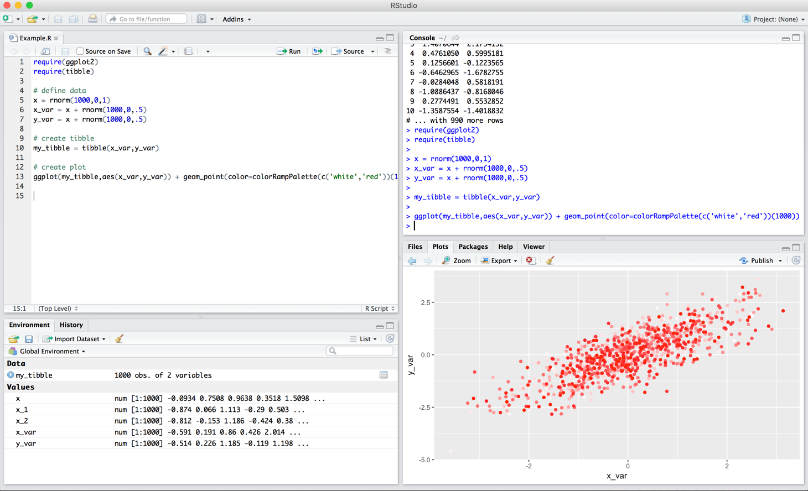
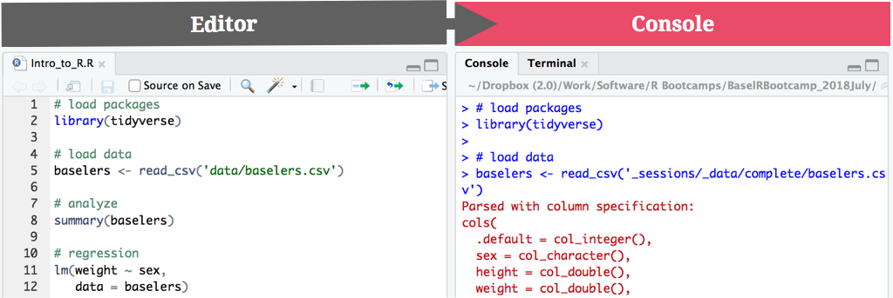

layout: true

<div class="my-footer">
  <span style="text-align:center">
    <span> 
      
    </span>
    <a href="https://therbootcamp.github.io/">
      <span style="padding-left:82px"> 
        <font color="#7E7E7E">
          https://therbootcamp.github.io
        </font>
      </span>
    </a>
    <a href="https://therbootcamp.github.io/">
      <font color="#7E7E7E">
      The R Bootcamp | June 2022
      </font>
    </a>
    </span>
  </div> 

---

```{r setup, include=FALSE}
options(htmltools.dir.version = FALSE)
# see: https://github.com/yihui/xaringan
# install.packages("xaringan")
# see: 
# https://github.com/yihui/xaringan/wiki
# https://github.com/gnab/remark/wiki/Markdown
options(width=110)
options(digits = 4)
require(tidyverse)
basel = readr::read_csv('1_data/basel.csv')
```

<!---
.pull-left45[

# What is "Wrangling"?

<ul>
  <li class="m1"><span><high>Transform</high>
  <br><br>
  <ul class="level">
    <li><span>Change column names</span></li>
    <li><span>Create new variables</span></li>
  </ul></span></li>
  <li class="m2"><span><high>Organize</high>
  <br><br>
  <ul class="level">
    <li><span>Sort rows</span></li>
    <li><span>Join data sets</span></li>
    <li><span>Transpose data</span></li>
  </ul></span></li>
  <li class="m3"><span><high>Aggregate</high>
  <br><br>
  <ul class="level">
    <li><span>Build groups</span></li>
    <li><span>Calculate statistics</span></li>
  </ul></span></li>
</ul>


]

.pull-right5[
<br>
<p align="center">

</p>

]

--->

# The R ecosphere

<br><br>
<p align="center">

</p>

---

# Base R primer

.pull-left4[

<ul>
  <li class="m1"><span>Assignments<br></span></li>
  <ul class="level">
    <li><span>Object <mono><-</mono> function</span></li>
    <li><span><mono><-</mono> creates objects</span></li>
  </ul><br>
  <li class="m2"><span>Functions</span></li>
  <ul class="level">
    <li><span>Everything that happens is a function call</span></li>
    <li><span>Functions have (default) arguments</span></li>
    <li><span>Beware object/argument classes</span></li>
    <li><span>Functions "live" in packages</span></li>
  </ul><br>
</ul>

]

.pull-right5[

<p align="center">
  
</p>


]

---

# Object <mono><-</mono> function

.pull-left4[

<ul>
  <li class="m1"><span>Assignments<br></span></li>
  <ul class="level">
    <li><span><high>Object <mono><-</mono> function</high></span></li>
    <li><span><mono><-</mono> creates objects</span></li>
  </ul><br>
  <li class="m2"><span>Functions</span></li>
  <ul class="level">
    <li><span>Everything that happens is a function call</span></li>
    <li><span>Functions have (default) arguments</span></li>
    <li><span>Beware object/argument classes</span></li>
    <li><span>Functions "live" in packages</span></li>
  </ul><br>
</ul>

]

.pull-right5[

<p align="center">
  
</p>


]

---

# <mono><-</mono> creates objects

.pull-left4[

<ul>
  <li class="m1"><span>Assignments<br></span></li>
  <ul class="level">
    <li><span>Object <mono><-</mono> function</span></li>
    <li><span><high><mono><-</mono> creates objects</high></span></li>
  </ul><br>
  <li class="m2"><span>Functions</span></li>
  <ul class="level">
    <li><span>Everything that happens is a function call</span></li>
    <li><span>Functions have (default) arguments</span></li>
    <li><span>Beware object/argument classes</span></li>
    <li><span>Functions "live" in packages</span></li>
  </ul><br>
</ul>

]

.pull-right5[
```{r}
# an object named score
score <- c(8, 4, 6, 3, 7, 3)

# print the object (aka show its contents)
print(score)

# print the object (aka show its contents)
score

```

]

---

# <mono><-</mono> creates objects

.pull-left4[

<ul>
  <li class="m1"><span>Assignments<br></span></li>
  <ul class="level">
    <li><span>Object <mono><-</mono> function</span></li>
    <li><span><high><mono><-</mono> creates objects</high></span></li>
  </ul><br>
  <li class="m2"><span>Functions</span></li>
  <ul class="level">
    <li><span>Everything that happens is a function call</span></li>
    <li><span>Functions have (default) arguments</span></li>
    <li><span>Beware object/argument classes</span></li>
    <li><span>Functions "live" in packages</span></li>
  </ul><br>
</ul>

]

.pull-right5[
```{r}
# an object named score
score <- c(8, 4, 6, 3, 7, 3)

# mean of score
mean(score)
```

]


---

# Functions 

.pull-left4[
<ul>
  <li class="m1"><span>Assignments<br></span></li>
  <ul class="level">
    <li><span>Object <mono><-</mono> function</span></li>
    <li><span><mono><-</mono> creates objects</span></li>
  </ul><br>
  <li class="m2"><span>Functions</span></li>
  <ul class="level">
    <li><span><high>Everything that happens is a function call</high></span></li>
    <li><span>Functions have (default) arguments</span></li>
    <li><span>Beware object/argument classes</span></li>
    <li><span>Functions "live" in packages</span></li>
  </ul><br>
</ul>
]

.pull-right5[
<p align="center"></p>
]

---

# Functions 

.pull-left4[
<ul>
  <li class="m1"><span>Assignments<br></span></li>
  <ul class="level">
    <li><span>Object <mono><-</mono> function</span></li>
    <li><span><mono><-</mono> creates objects</span></li>
  </ul><br>
  <li class="m2"><span>Functions</span></li>
  <ul class="level">
    <li><span><high>Everything that happens is a function call</high></span></li>
    <li><span>Functions have (default) arguments</span></li>
    <li><span>Beware object/argument classes</span></li>
    <li><span>Functions "live" in packages</span></li>
  </ul><br>
</ul>
]

.pull-right5[

```{r}
# an object named score
score <- c(8, 4, 6, 3, 7, 3)

# print the object (aka show its contents)
score

# mean of score
mean(score)

```
]


---

# Arguments 

.pull-left4[
<ul>
  <li class="m1"><span>Assignments<br></span></li>
  <ul class="level">
    <li><span>Object <mono><-</mono> function</span></li>
    <li><span><mono><-</mono> creates objects</span></li>
  </ul><br>
  <li class="m2"><span>Functions</span></li>
  <ul class="level">
    <li><span>Everything that happens is a function call</span></li>
    <li><span><high>Functions have (default) arguments</high></span></li>
    <li><span>Beware object/argument classes</span></li>
    <li><span>Functions "live" in packages</span></li>
  </ul><br>
</ul>
]

.pull-right5[
```{r, error=TRUE, tidy=T}
# no argument
mean()

# one (necessary) argument
mean(score)

# one (necessary) argument with name
mean(x = score)

# NA added to vector score
mean(x = c(score, NA))
```
]


---

# Arguments 

.pull-left4[
<ul>
  <li class="m1"><span>Assignments<br></span></li>
  <ul class="level">
    <li><span>Object <mono><-</mono> function</span></li>
    <li><span><mono><-</mono> creates objects</span></li>
  </ul><br>
  <li class="m2"><span>Functions</span></li>
  <ul class="level">
    <li><span>Everything that happens is a function call</span></li>
    <li><span><high>Functions have (default) arguments</high></span></li>
    <li><span>Beware object/argument classes</span></li>
    <li><span>Functions "live" in packages</span></li>
  </ul><br>
</ul>
]

.pull-right5[
```{r, error=TRUE,tidy=T}
# no argument
mean()

# one (necessary) argument
mean(score)

# one (necessary) argument with name
mean(x = score)

# change default in additional argument
mean(x = c(score, NA), na.rm = TRUE)

```
]

---

# Classes 

.pull-left4[
<ul>
  <li class="m1"><span>Assignments<br></span></li>
  <ul class="level">
    <li><span>Object <mono><-</mono> function</span></li>
    <li><span><mono><-</mono> creates objects</span></li>
  </ul><br>
  <li class="m2"><span>Functions</span></li>
  <ul class="level">
    <li><span>Everything that happens is a function call</span></li>
    <li><span>Functions have (default) arguments</span></li>
    <li><span><high>Beware object/argument classes</high></span></li>
    <li><span>Functions "live" in packages</span></li>
  </ul><br>
</ul>
]

.pull-right5[

<p align = "center">
<br>
</p>

]


---

# Packages 

.pull-left4[
<ul>
  <li class="m1"><span>Assignments<br></span></li>
  <ul class="level">
    <li><span>Object <mono><-</mono> function</span></li>
    <li><span><mono><-</mono> creates objects</span></li>
  </ul><br>
  <li class="m2"><span>Functions</span></li>
  <ul class="level">
    <li><span>Everything that happens is a function call</span></li>
    <li><span>Functions have (default) arguments</span></li>
    <li><span>Beware object/argument classes</span></li>
    <li><span><high>Functions "live" in packages</high></span></li>
  </ul><br>
</ul>
]

.pull-right5[

<high>Install</high> package <high>once</high> using `install.packages()`

```{r, eval = FALSE}
install.packages("tidyverse")
```
<br2>
<high>Load</high> existing package <high>every time</high> using `library()`

```{r, eval = FALSE}
library(tidyverse)
```

<p align="left"></p>
]


---

# The R ecosphere

<br><br>
<p align="center">

</p>


---

.pull-left3[

# Tidyverse

<ul>
  <li class="m1"><span>The tidyverse is...</span></li><br>
  <ul class="level">
    <li><span>A collection of user-friendly <high>packages</high> for analyzing <high>tidy data</high></span></li><br>
    <li><span>An <high>ecosystem</high> for analytics and data science with common design principles</span></li><br>
    <li><span>A <high>dialect</high> of the R language</span></li>
  </ul>
</ul>

]

.pull-right65[
<br><br>
<p align="center">

</p>
]


---


.pull-left3[

# Tidyverse

<ul>
  <li class="m1"><span>The tidyverse is...</span></li><br>
  <ul class="level">
    <li><span>A collection of user-friendly <high>packages</high> for analyzing <high>tidy data</high></span></li><br>
    <li><span>An <high>ecosystem</high> for analytics and data science with common design principles</span></li><br>
    <li><span>A <high>dialect</high> of the R language</span></li>
  </ul>
</ul>

]

.pull-right65[
<br><br>
<p align="center">

</p>
]

---

# <mono>%>%</mono>

.pull-left45[

<ul>
  <li class="m1"><span>The <high>novel pipe operator</high> from the <a href="https://cran.r-project.org/web/packages/magrittr/vignettes/magrittr.html"><mono>magrittr</mono></a> package makes chaining commands easy.</span></li>
</ul>

<br>
<p align="center">
  
</p>

]

.pull-right45[


```{r}
# Numeric vector
score <- c(8, 4, 6, 3, 7, 3)
score

# Mean: Base-R-style
mean(score)

# Mean: dplyr-style
score %>%  
  mean()  
```


]


---

# <mono>%>%</mono>

.pull-left45[

<ul>
  <li class="m1"><span>The <high>novel pipe operator</high> from the <a href="https://cran.r-project.org/web/packages/magrittr/vignettes/magrittr.html"><mono>magrittr</mono></a> package makes chaining commands easy.</span></li>
</ul>

<br>
<p align="center">
  
</p>

]

.pull-right45[

<p align="center">
  
</p>

]

---

# <mono>readr</mono>


.pull-left45[

<ul>
  <li class="m1"><span>Benefits over <mono>read.csv</mono>:</span></li>
  <ul class="level">
    <li><span>Better type inference</span></li>
    <li><span>Avoids <mono>factors</mono></span></li>
    <li><span>Produces <highm>tibble</highm></span></li>
  </ul></span></li>
</ul>

<br>
<p align="center">
  
</p>

]


.pull-right45[

<p align="center">
  
</p>

]


---

# <mono>readr</mono>

.pull-left45[

<ul>
  <li class="m1"><span>Benefits over <mono>read.csv</mono>:</span></li>
  <ul class="level">
    <li><span>Better type inference</span></li>
    <li><span>Avoids <mono>factors</mono></span></li>
    <li><span>Produces <highm>tibble</highm></span></li>
  </ul></span></li>
</ul>

<br>
<p align="center">
  
</p>

]

.pull-right45[

```{r, echo = F, message=F}
require(tibble)
options(tibble.width = 35, tibble.max_extra_cols = 10, tibble.print_max = 3,
        tibble.print_min = 5)
```


```{r, message = F}
# Read in taxation
basel <- read_csv("1_Data/taxation.csv")

basel

```

]


---

# <mono>tibble</mono>

.pull-left45[

<ul>
  <li class="m1"><span>Benefits over <mono>data.frame</mono>:</span></li>
  <ul class="level">
    <li><span><high>Better print</high>: More informative and cleaner</span></li>
    <li><span>More consistent subsetting</span></li>
  </ul></span></li>
</ul>

<br>
<p align="center">
  
</p>

]

.pull-right45[

```{r, echo = F, message=F}
require(tibble)
options(tibble.width = 35, tibble.max_extra_cols = 10, tibble.print_max = 3,
        tibble.print_min = 5)
```


```{r, message = F}
# Read in taxation
basel <- read_csv("1_Data/taxation.csv")

basel

```

]

---

.pull-left45[

# <mono>dplyr</mono>

<ul>
  <li class="m1"><span>Benefits over Base R:</span></li>
  <ul class="level">
    <li><span><high>No more brackets</high></span></li>
    <li><span><high>Data masking</high></span></li>
    <li><span>Tidy selection</span></li>
    <li><span>Intuitively named functions</span></li>
  </ul></span></li>
</ul>

<br>
<p align="center">
  
</p>

]

.pull-right5[

<br><br>

<table cellspacing="0" cellpadding="0" class="clean_table" width="100%">
<col width="42%">
<col width="58%">
<tr>
<td><b>Key verbs</b></td>
<td><b>Purpose</b></td>
</tr>
<tr>
<td style="padding-top:20px"><i>Transformation</i></td>
<td></td>
</tr>
<tr>
<td><mono>rename()</mono></td>
<td>Rename column names</td>
</tr>
<tr>
<td><mono>mutate()</mono></td>
<td>Create/change columns</td>
</tr>
<td style="padding-top:20px"><i>Organization</i></td>
<td></td>
</tr>
<tr>
<td><mono>arrange()</mono></td>
<td>Sort</td>
</tr>
<tr>
<td><mono>select()</mono></td>
<td>Select variables</td>
</tr>
<tr>
<td><mono>slice()</mono>, <mono>filter()</mono></td>
<td>Select rows</td>
</tr>
<tr>
<td><mono>left_join()</mono>, <mono>inner_join()</mono>, etc.</td>
<td>Join data sets</td>
</tr>
<td style="padding-top:20px"><i>Aggregation</i></td>
<td></td>
</tr>
<tr>
<td><mono>summarize()</mono></td>
<td>Calculate statistics</td>
</tr>
<tr>
<td><mono>group()</mono></td>
<td>Summarize group-wise</td>
</tr>
</table>


]

---

```{r, echo = F, message=F}
require(tibble)
options(tibble.width = 35, tibble.max_extra_cols = 10, tibble.print_max = 5,
        tibble.print_min = 8)
```


# `select()`

.pull-left4[

```{r, eval = FALSE}
# Select two columns
TIBBLE %>% 
  select(VAR1, VAR2)

# Select everything but 
TIBBLE %>% 
  select(-VAR1)
```

]

.pull-right5[

```{r}
basel %>%
  
  # Select columns
  select(year, quarter, income_mean)
```

]


<!---

# `slice()`

.pull-left4[

```{r, eval = F}
# Slice using :
TIBBLE %>%
  slice(INDEX_START:INDEX_STOP)

# Slice using vector  
TIBBLE %>%
  slice(c(INDEX1, INDEX2, ...))
```


]

.pull-right5[

```{r}
basel %>%
    select(year, quarter, income_mean) %>%

  # Select rows 20 to 30
  slice(20:30)
```


]

--->

---

# `filter()`

.pull-left4[

```{r, eval = F}
# Filter using logical comparisons
TIBBLE %>%
  filter(VAR1 == VAL1,
         VAR2 > VAL2,
         VAR3 < VAL3,
         VAR4 == VAL4 | VAR5 < VAL5)
```
]

.pull-right5[

```{r}
basel %>%
    select(year, quarter, income_mean) %>%

  # Select rows rows where year is 2017
  filter(year == 2017)
```

]


---

# `arrange()`

.pull-left4[

```{r, echo = TRUE, eval = FALSE}
# Sort ascending
TIBBLE %>%
  arrange(VAR1, VAR2)

# Sort descending w/ desc()
TIBBLE %>%
  arrange(desc(VAR1), VAR2)
```

]

.pull-right5[
```{r}
basel %>%
  select(year, quarter, income_mean) %>%
  filter(year == 2017) %>% 
  
  # Sort by income
  arrange(income_mean)
```

]

---

# `summarize()`

.pull-left4[


```{r, echo = TRUE, eval = FALSE}
# Create new summary variables
TIBBLE %>%
  summarise(
    NAME1 = SUMMARY_FUN(VAR1),
    NAME2 = SUMMARY_FUN(VAR2)
  )
```


]

.pull-right5[

```{r}
basel %>%
  filter(year == 2017) %>% 
 
  # Calculate averages in 2017
  summarize(
    income = mean(income_mean),
    wealth = mean(wealth_mean))
```


]

<!---


# `summarise_if()`

.pull-left4[


```{r, echo = TRUE, eval = FALSE}
# Create new summary variables
TIBBLE %>%
  summarise_if(
    CONDITION,
    SUMMARY_FUN
  )
```


]

.pull-right5[

```{r}
basel %>% 
  
  # Calculate averages in 2017
  summarize_if(is.numeric,
               mean)
```


]

--->

---

# `group_by()`

.pull-left4[

```{r, eval = F}
# Create grouped summary variables
TIBBLE %>%
  group_by(GRUPPEN_VAR) %>%
  summarise(
    NAME1 = SUMMARY_FUN(VAR1),
    NAME2 = SUMMARY_FUN(VAR2)
  )
```


]

.pull-right5[

```{r, message=F}
basel %>%
  
  # Calculate averages for all years
  group_by(year) %>% 
  summarize(
    income = mean(income_mean),
    wealth = mean(wealth_mean))
```

]

---

# `group_by()`

.pull-left4[

```{r, eval = F}
# Create grouped summary variables
TIBBLE %>%
  group_by(GRUPPEN_VAR) %>%
  summarise(
    NAME1 = SUMMARY_FUN(VAR1),
    NAME2 = SUMMARY_FUN(VAR2)
  )
```


]

.pull-right5[

```{r, message=F}
basel %>%
  
  # Calculate averages for all years
  group_by(year) %>% 
  summarize(
    income = mean(income_mean),
    wealth = mean(wealth_mean)) %>% 
  arrange(income) 
```

]

---

```{r, echo = F, message=F}
require(tibble)
options(tibble.width = 35, tibble.max_extra_cols = 6, tibble.print_max = 6,
        tibble.print_min = 8)
```


.pull-left4[

# `*_join()`

```{r, eval = FALSE}
# Join two tibbles
TIBBLE1 %>%
  left_join(TIBBLE2, 
            by = c("KEY1" = "KEY2"))
```

]

.pull-right5[

<br>

```{r,error=TRUE, message=F}
basel %>%
  group_by(year) %>% 
  summarize(
    income = mean(income_mean),
    wealth = mean(wealth_mean)) %>% 
  
  # join back to basel
  right_join(basel)
```
]


---

```{r, echo = F, message=F}
require(tibble)
options(tibble.width = 35, tibble.max_extra_cols = 10, tibble.print_max = 5,
        tibble.print_min = 8)
```


# <mono>tidyr</mono>

.pull-left4[

<ul>
  <li class="m1"><span>Benefits over Base R:</span></li>
  <ul class="level">
    <li><span>Did not exist before.</span></li>
  </ul></span></li>
</ul>

<br>
<p align="center">
  
</p>

]

.pull-right5[

<p align="center">
<br>
<font style="font-size:10px">adapted from <a href="https://github.com/gadenbuie/tidyexplain">tidyexplain</a></font>
</p>

]

---

# `pivot_longer()`

.pull-left4[

```{r, eval = F}
# wide to long
TIBBLE %>% 
  pivot_longer(cols = VARS,
               names_to = NAME1,
               values_to = NAME2)
```

]

.pull-right5[

```{r}
# wide to long
basel %>% 
 select(year, quarter, 
        income_mean, wealth_mean) %>% 
 pivot_longer(cols = c(income_mean, wealth_mean),
              names_to = 'name',
              values_to = 'value')
```
]

---

# The R ecosphere

<br><br>
<p align="center">

</p>


---

# RStudio

.pull-left3[

<ul>
  <li class="m1"><span>RStudio is...</span></li><br>
  <ul class="level">
    <li><span>A high-productivity <high>data science IDE.</high></span></li><br>
    <li><span>The <high>company</high> behind the tidyverse.</span></li><br>
    <li><span>Designed for R tidyverse with <high>good integration</high> for Python, Markdown, or C++.</span></li><br>
  </ul>
</ul>

]

.pull-right6[
<p align="center">

</p>
]

---

# RStudio

.pull-left3[

<ul>
  <li class="m1"><span>RStudio is...</span></li><br>
  <ul class="level">
    <li><span>A high-productivity <high>data science IDE.</high></span></li><br>
    <li><span>The <high>company</high> behind the tidyverse.</span></li><br>
    <li><span>Designed for R tidyverse with <high>good integration</high> for Python, Markdown, or C++.</span></li><br>
  </ul>
</ul>

]

.pull-right5[

<p align = "left">
  
<br><br><br>
Shortcut for <high>send Code to Console</high>:<br><br2><font size = 6>&#8984;/ctrl + &#9166;</font><br><br2><br2>
Shortcut for <high>run Chunk again</high>:<br><br2><font size = 6>  &#8984;/ctrl + &#8997; + p</font>
</p>

]

---

# RStudio

.pull-left3[

<ul>
  <li class="m1"><span>RStudio is...</span></li><br>
  <ul class="level">
    <li><span>A high-productivity <high>data science IDE.</high></span></li><br>
    <li><span>The <high>company</high> behind the tidyverse.</span></li><br>
    <li><span>Designed for R tidyverse with <high>good integration</high> for Python, Markdown, or C++.</span></li><br>
  </ul>
</ul>

]

.pull-right5[

<p align = "center">
  
</p>

]

---

# RStudio

.pull-left3[

<ul>
  <li class="m1"><span>RStudio is...</span></li><br>
  <ul class="level">
    <li><span>A high-productivity <high>data science IDE.</high></span></li><br>
    <li><span>The <high>company</high> behind the tidyverse.</span></li><br>
    <li><span>Designed for R tidyverse with <high>good integration</high> for Python, Markdown, or C++.</span></li><br>
  </ul>
</ul>

]

.pull-right5[

<p align = "left">
  
</p>

]


---

class: middle, center

<h1><a href="">Practical</a></h1>

