layout: true

<div class="my-footer">
  <span style="text-align:center">
    <span> 
      
    </span>
    <a href="https://therbootcamp.github.io/">
      <span style="padding-left:82px"> 
        <font color="#7E7E7E">
          https://therbootcamp.github.io
        </font>
      </span>
    </a>
    <a href="https://therbootcamp.github.io/">
      <font color="#7E7E7E">
      The R Bootcamp | June 2022
      </font>
    </a>
    </span>
  </div> 

---

```{r setup, include=FALSE}
options(htmltools.dir.version = FALSE)
options(width = 110)
options(digits = 4)

# Load packages
require(tidyverse)
library(leaflet)
library(plotly)

# load color set
source("../../_materials/palette/therbootcamp_palettes.R")

# knitr options
knitr::opts_chunk$set(dpi = 300, echo = FALSE, warning = FALSE, fig.align = 'center', message= FALSE)

# special print function: avoid if possible
print2 <- function(x, nlines=10,...) {
   cat(head(capture.output(print(x,...)), nlines), sep="\n")}

basel <- read_csv("1_data/taxation.csv")

```

# What is Markdown?

.pull-left4[

<ul>
  <li class="m1"><span>Developed by John Gruber and Aaron Swartz in 2004.<br><br>
  "<high>easy-to-read</high> and <high>easy-to-write</high> plain text format, [...] convert it to structurally valid XHTML (or HTML)"</span></li> 
  <li class="m2"><span>Simple <high>syntax for formatting</high> documents.</span></li>  
  <ul>
    <li><span>highlight text with bold and italic</span></li>   
    <li><span>lists</span></li>  
    <li><span>headers</span></li> 
    <li><span>hyperlinks</span></li>
    <li><span>images</span></li>
  </ul>
</ul>

]

.pull-right5[

<br>

<p align = "center">
  <br>
  <font style="font-size:10px">from <a href="https://de.wikipedia.org/wiki/Markdown">wikipedia.org</a></font>
</p>

]

---

# What is R Markdown?

.pull-left4[

<ul>
  <li class="m1"><span>Uses Markdown for <high>formatting dynamic reports</high> that include ...</span></li><br> 
  <ul>
    <li><span><high>R code chunks</high></span></li>
    <li><span><high>R inline Code</high></span></li>  
    <li><span><high>Visualizations</high></span></li>
    <li><span>Statistical outputs</span></li>
    <li><span>Tables</span></li>
    <li><span>etc.</span></li>
  </ul>
</ul>

]

.pull-right5[

<p align = "center">
  <br>
  <font style="font-size:10px">from <a href="https://rmarkdown.rstudio.com/docs/">rmarkdown.rstudio.com</a></font>
</p>

]

---

# R Markdown elements

.pull-left4[

<ul>
  <li class="m1"><span>RMarkdown scripts consist of several <high>elements</high>.</span></li>
</ul>

<table style="cellspacing:0; cellpadding:0; border:none; padding-top:10px" width=100%>
  <col width="40%">
  <col width="60%">
<tr>
  <td bgcolor="white">
    <b>Element</b>
  </td>
  <td bgcolor="white">
    <b>Description</b>
  </td> 
</tr>
<tr>
  <td bgcolor="white">
  <mono>YAML</mono>
  </td>
  <td bgcolor="white">
  <b>Y</b>AML <b>A</b>in't <b>M</b>arkup <b>L</b>anguage<br>
  <high>general document settings</high>
  </td> 
</tr>
<tr>
  <td bgcolor="white">
  <mono>Setup chunk</mono>
  </td>
  <td bgcolor="white">
  control <high>chunks</high> settings<br>
  load <high>packages</high><br>
  load <high>data</high>
  </td> 
</tr>
<tr>
  <td bgcolor="white">
  <mono>Markdown</mono>
  </td>
  <td bgcolor="white">
  <high>header</high><br>
  <high>text</high> highlighting
  </td> 
</tr>
<tr>
  <td bgcolor="white">
  <mono>Code chunk</mono>
  </td>
  <td bgcolor="white">
  R <high>Code</high><br>
  R <high>Outputs<high>
  </td> 
</tr>
</table>

]

.pull-right5[

<p align = "center">
  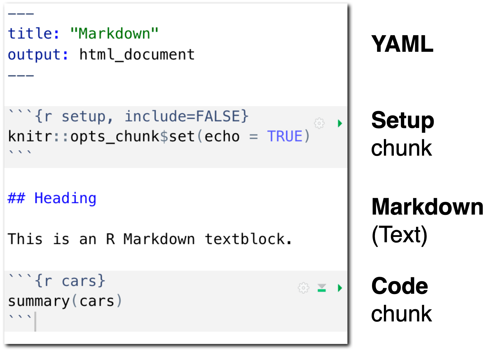
</p>

]

---

# Pipeline

.pull-left4[

<ul>
  <li class="m1"><span>RMarkdown can be translated into different <high>document types</high>.</span></li><br>
    <ul>
    <li><span>PDF</span></li>
    <li><span>HTML</span></li>   
    <li><span>Word</span></li>
    <li><span>PowerPoint</span></li>
  </ul><br>
  <li class="m2"><span>To this end, <high>several translation steps</high> are necessary.</span></li><br>
</ul>

]

.pull-right5[

<p align = "center">
  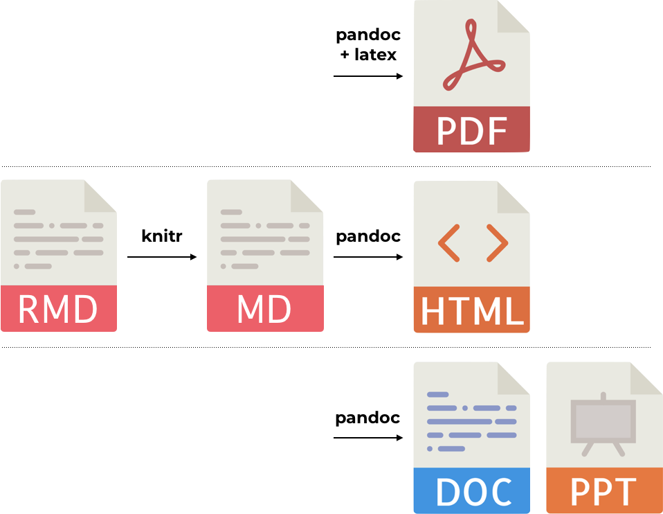
</p>

]

---

# HTML Pipeline

.pull-left4[

<ul>
  <li class="m1"><span>HTML is a <high>universal framework</high> for documents, presentations, and dashboards</span></li>
  <li class="m2"><span>HTML <high>export to PDF</high> is often straightforward.</span></li><br>
</ul>

]

.pull-right5[

<p align = "center">
  
</p>

]

---

# HTML

.pull-left3[

<ul>
  <li class="m1"><span><b>H</b>yper<b>T</b>ext <b>M</b>arkup <b>L</b>anguage.</span></li>
  <li class="m2"><span>The format of the <high>World Wide Web</high>s.</span></li>
  <li class="m3"><span>Affords flexible styling through <high>CSS</high> (Cascading Style Sheets).</span></li>
</ul>

]

.pull-right6[

<br>
<p align = "center">
  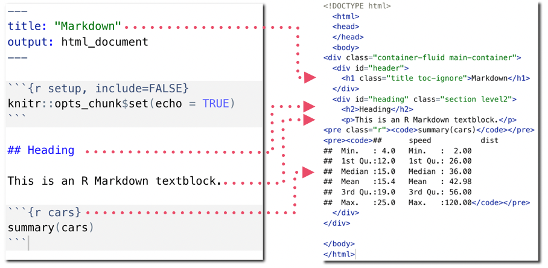
</p>

]

---

# Render

.pull-left3[

<ul>
  <li class="m1"><span>HTML gets <high>interpreted</high> in RStudio (or browsers) so that a well-formatted document emerges.</span></li>
  <li class="m2"><span><high>Rstudio</high> also shows rendered documents (rather than the raw html). </span></li><br>
</ul>

]

.pull-right6[

<br>
<p align = "center">
  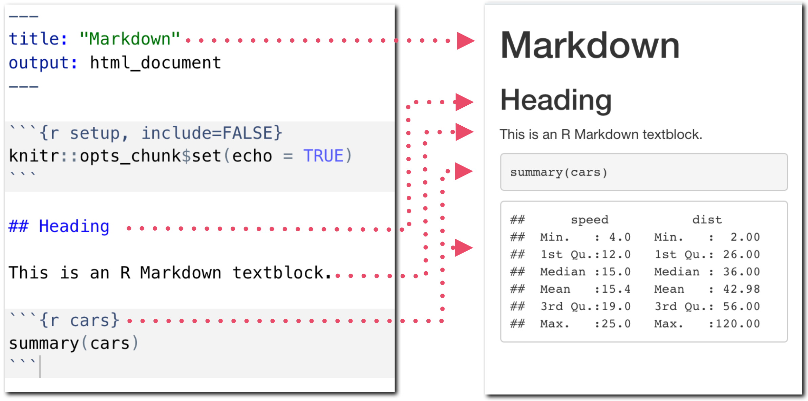
</p>

]

---

# Headers

.pull-left3[

<ul>
  <li class="m1"><span>Headers on different <high>levels</high> can be set using <mono>#</mono>.</span></li>
</ul>

<table style="cellspacing:0; cellpadding:0; border:none; padding-top:20px" width=100%>
  <col width="40%">
  <col width="60%">
<tr>
  <td bgcolor="white">
    <b>Markdown</b>
  </td>
  <td bgcolor="white">
    <b>Description</b>
  </td> 
</tr>
<tr>
  <td bgcolor="white">
  <mono># text</mono>
  </td>
  <td bgcolor="white">
  level 1
  </td> 
</tr>
<tr>
  <td bgcolor="white">
  <mono>## text</mono>
  </td>
  <td bgcolor="white">
  level 2
  </td> 
</tr>
<tr>
  <td bgcolor="white">
  <mono>...</mono>
  </td>
  <td bgcolor="white">
  ...
  </td> 
</tr>
<tr>
  <td bgcolor="white">
  <mono>##### txt</mono>
  </td>
  <td bgcolor="white">
  level 5
  </td> 
</tr>
</table>

]

.pull-right6[

<br>
<p align = "center">
  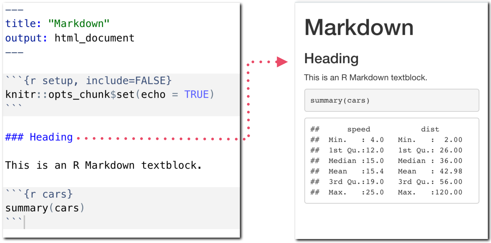
</p>

]

---

# Headers

.pull-left3[

<ul>
  <li class="m1"><span>Headers on different <high>levels</high> can be set using <mono>#</mono>.</span></li>
</ul>

<table style="cellspacing:0; cellpadding:0; border:none; padding-top:20px" width=100%>
  <col width="40%">
  <col width="60%">
<tr>
  <td bgcolor="white">
    <b>Markdown</b>
  </td>
  <td bgcolor="white">
    <b>Description</b>
  </td> 
</tr>
<tr>
  <td bgcolor="white">
  <mono># text</mono>
  </td>
  <td bgcolor="white">
  level 1
  </td> 
</tr>
<tr>
  <td bgcolor="white">
  <mono>## text</mono>
  </td>
  <td bgcolor="white">
  level 2
  </td> 
</tr>
<tr>
  <td bgcolor="white">
  <mono>...</mono>
  </td>
  <td bgcolor="white">
  ...
  </td> 
</tr>
<tr>
  <td bgcolor="white">
  <mono>##### txt</mono>
  </td>
  <td bgcolor="white">
  level 5
  </td> 
</tr>
</table>

]

.pull-right6[

<br>
<p align = "center">
  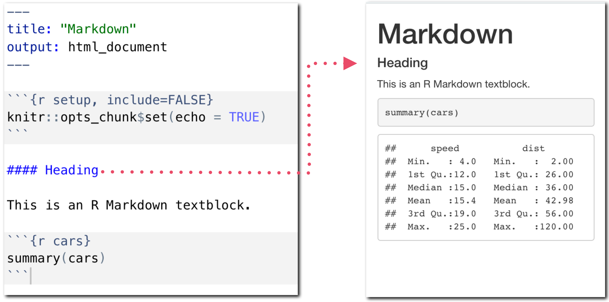
</p>

]

---

# Highlighting

.pull-left3[

<ul>
  <li class="m1"><span>Various operators enable <high>text- and code</high> highlighting.</span></li>
</ul>

<table style="cellspacing:0; cellpadding:0; border:none; padding-top:20px" width=100%>
  <col width="50%">
  <col width="50%">
<tr>
  <td bgcolor="white">
    <b>Markdown</b>
  </td>
  <td bgcolor="white">
    <b>Description</b>
  </td> 
</tr>
<tr>
  <td bgcolor="white">
  &ast;<mono>text</mono>&ast;
  </td>
  <td bgcolor="white">
  italic
  </td> 
</tr>
<tr>
  <td bgcolor="white">
  &ast;&ast;<mono>text</mono>&ast;&ast;
  </td>
  <td bgcolor="white">
  bold
  </td> 
</tr>
<tr>
  <td bgcolor="white">
  &ast;&ast;&ast;<mono>text</mono>&ast;&ast;&ast;
  </td>
  <td bgcolor="white">
  italic and bold 
  </td> 
</tr>
<tr>
  <td bgcolor="white">
  &grave;<mono>text</mono>&grave;
  </td>
  <td bgcolor="white">
  code
  </td> 
</tr>
<tr>
  <td bgcolor="white">
  &grave;<mono>r "text"</mono>&grave;
  </td>
  <td bgcolor="white">
  inline code
  </td> 
</tr>
</table>

]

.pull-right6[

<br>
<p align = "center">
  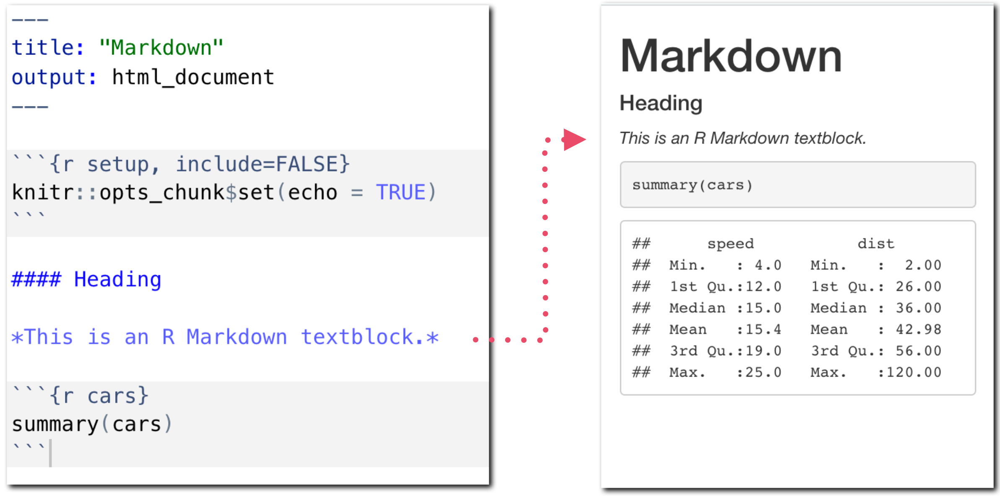
</p>

]

---

# Highlighting

.pull-left3[

<ul>
  <li class="m1"><span>Various operators enable <high>text- and code</high> highlighting.</span></li>
</ul>

<table style="cellspacing:0; cellpadding:0; border:none; padding-top:20px" width=100%>
  <col width="50%">
  <col width="50%">
<tr>
  <td bgcolor="white">
    <b>Markdown</b>
  </td>
  <td bgcolor="white">
    <b>Description</b>
  </td> 
</tr>
<tr>
  <td bgcolor="white">
  &ast;<mono>text</mono>&ast;
  </td>
  <td bgcolor="white">
  italic
  </td> 
</tr>
<tr>
  <td bgcolor="white">
  &ast;&ast;<mono>text</mono>&ast;&ast;
  </td>
  <td bgcolor="white">
  bold
  </td> 
</tr>
<tr>
  <td bgcolor="white">
  &ast;&ast;&ast;<mono>text</mono>&ast;&ast;&ast;
  </td>
  <td bgcolor="white">
  italic and bold 
  </td> 
</tr>
<tr>
  <td bgcolor="white">
  &grave;<mono>text</mono>&grave;
  </td>
  <td bgcolor="white">
  code
  </td> 
</tr>
<tr>
  <td bgcolor="white">
  &grave;<mono>r "text"</mono>&grave;
  </td>
  <td bgcolor="white">
  inline code
  </td> 
</tr>
</table>

]

.pull-right6[

<br>
<p align = "center">
  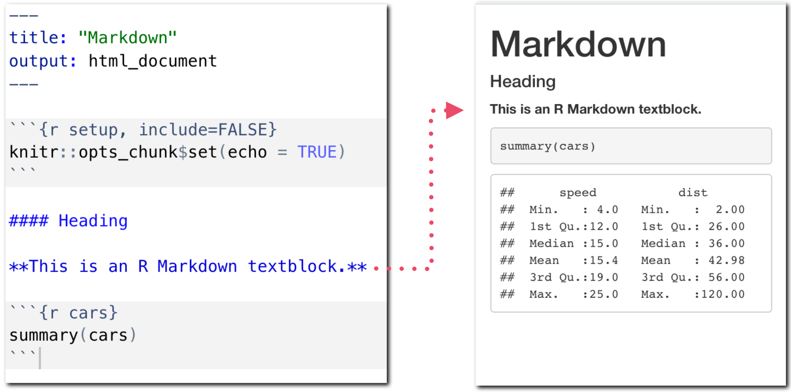
</p>

]


---

# Highlighting

.pull-left3[

<ul>
  <li class="m1"><span>Various operators enable <high>text- and code</high> highlighting.</span></li>
</ul>

<table style="cellspacing:0; cellpadding:0; border:none; padding-top:20px" width=100%>
  <col width="50%">
  <col width="50%">
<tr>
  <td bgcolor="white">
    <b>Markdown</b>
  </td>
  <td bgcolor="white">
    <b>Description</b>
  </td> 
</tr>
<tr>
  <td bgcolor="white">
  &ast;<mono>text</mono>&ast;
  </td>
  <td bgcolor="white">
  italic
  </td> 
</tr>
<tr>
  <td bgcolor="white">
  &ast;&ast;<mono>text</mono>&ast;&ast;
  </td>
  <td bgcolor="white">
  bold
  </td> 
</tr>
<tr>
  <td bgcolor="white">
  &ast;&ast;&ast;<mono>text</mono>&ast;&ast;&ast;
  </td>
  <td bgcolor="white">
  italic and bold 
  </td> 
</tr>
<tr>
  <td bgcolor="white">
  &grave;<mono>text</mono>&grave;
  </td>
  <td bgcolor="white">
  code
  </td> 
</tr>
<tr>
  <td bgcolor="white">
  &grave;<mono>r "text"</mono>&grave;
  </td>
  <td bgcolor="white">
  inline code
  </td> 
</tr>
</table>

]


.pull-right6[

<br>
<p align = "center">
  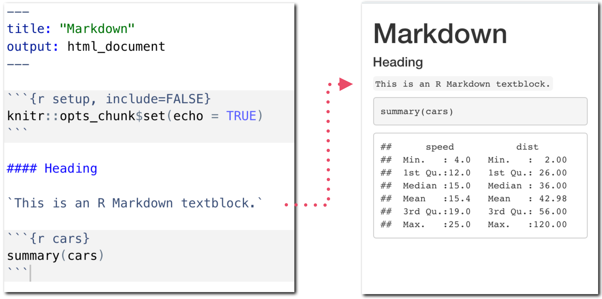
</p>

]


---

# Inline code

.pull-left3[

<ul>
  <li class="m1"><span><high>Numbers or labels</high> in text can be parameterized using inline code.</span></li>
  <li class="m2"><span>Inline code can include <high>any</high> type/length of code.</span></li>
</ul>

]

.pull-right6[

<br>
<p align = "center">
  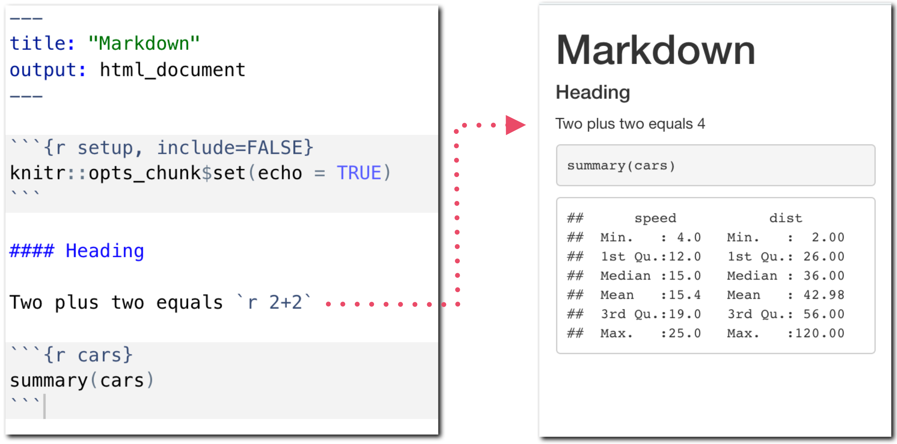
</p>

]

---

# Chunks

.pull-left3[

<ul>
  <li class="m1"><span>A <high>code <mono>chunk</mono></high> can contain any R code.</span></li>
  <li class="m2"><span>The behavior of code chunks can be controlled using <high>chunk arguments</high>.</span></li>
</ul>

]

.pull-right6[

<br>
<p align = "center">
  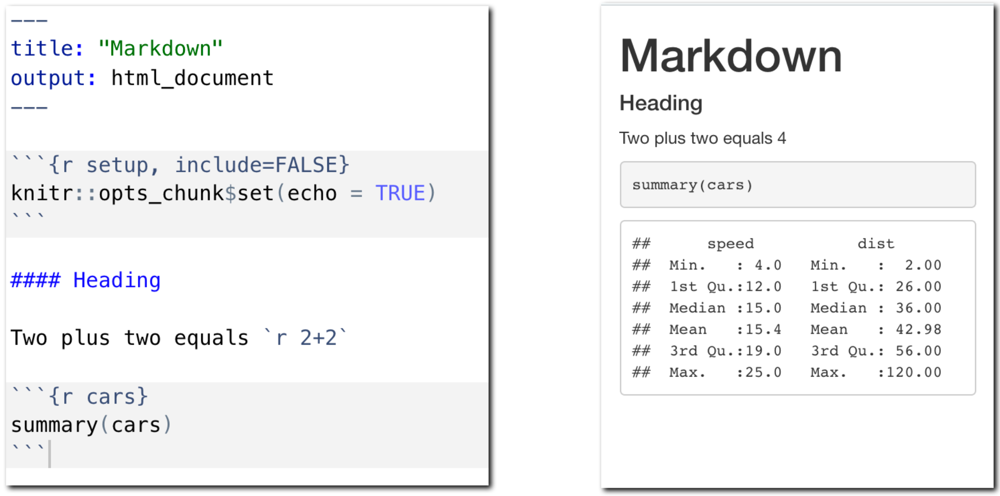
</p>

]

---

# Chunks

.pull-left3[

<table style="cellspacing:0; cellpadding:0; border:none; padding-top:60px" width=100%>
  <col width="60%">
  <col width="40%">
<tr>
  <td bgcolor="white">
    <b>Argument</b>
  </td>
  <td bgcolor="white">
    <b>Description</b>
  </td> 
</tr>
<tr>
  <td bgcolor="white">
  <mono>echo=T/F</mono>
  </td>
  <td bgcolor="white">
  Show/hide <high>code</high>.
  </td> 
</tr>
<tr>
  <td bgcolor="white">
  <mono>eval=T/F</mono>
  </td>
  <td bgcolor="white">
  Run/not-run <high>code</high>.
  </td> 
</tr>
<tr>
  <td bgcolor="white">
  <mono>include=T/F</mono>
  </td>
  <td bgcolor="white">
  Include/exclude all <high>output</high>.
  </td> 
</tr>
<tr>
  <td bgcolor="white">
  <mono>message=T/F</mono>
  </td>
  <td bgcolor="white">
  Include/exclude <highm>messages</highm> in output.
  </td> 
</tr>
<tr>
  <td bgcolor="white">
  <mono>warning=T/F</mono>
  </td>
  <td bgcolor="white">
  Include/exclude <highm>warnings</highm> in output.
  </td> 
</tr>
</table>

<p align="center" style="font-size:12px;padding-top:10px"><mono>T/F = TRUE/FALSE</mono></p>

]

.pull-right6[

<br>
<p align = "center">
  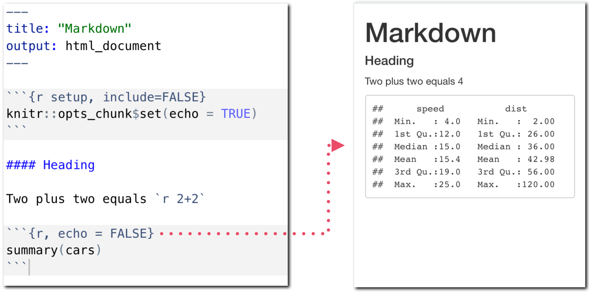
</p>

]


---

# Chunks

.pull-left3[

<table style="cellspacing:0; cellpadding:0; border:none; padding-top:60px" width=100%>
  <col width="60%">
  <col width="40%">
<tr>
  <td bgcolor="white">
    <b>Argument</b>
  </td>
  <td bgcolor="white">
    <b>Description</b>
  </td> 
</tr>
<tr>
  <td bgcolor="white">
  <mono>echo=T/F</mono>
  </td>
  <td bgcolor="white">
  Show/hide <high>code</high>.
  </td> 
</tr>
<tr>
  <td bgcolor="white">
  <mono>eval=T/F</mono>
  </td>
  <td bgcolor="white">
  Run/not-run <high>code</high>.
  </td> 
</tr>
<tr>
  <td bgcolor="white">
  <mono>include=T/F</mono>
  </td>
  <td bgcolor="white">
  Include/exclude all <high>output</high>.
  </td> 
</tr>
<tr>
  <td bgcolor="white">
  <mono>message=T/F</mono>
  </td>
  <td bgcolor="white">
  Include/exclude <highm>messages</highm> in output.
  </td> 
</tr>
<tr>
  <td bgcolor="white">
  <mono>warning=T/F</mono>
  </td>
  <td bgcolor="white">
  Include/exclude <highm>warnings</highm> in output.
  </td> 
</tr>
</table>

<p align="center" style="font-size:12px;padding-top:10px"><mono>T/F = TRUE/FALSE</mono></p>

]

.pull-right6[

<br>
<p align = "center">
  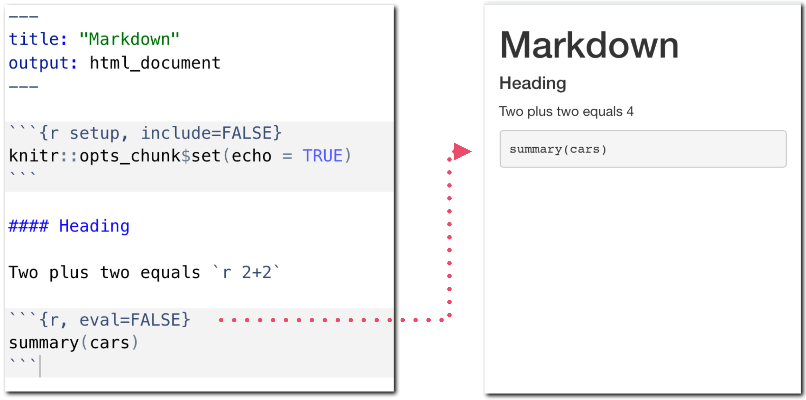
</p>

]


---

# Chunks

.pull-left3[

<table style="cellspacing:0; cellpadding:0; border:none; padding-top:60px" width=100%>
  <col width="60%">
  <col width="40%">
<tr>
  <td bgcolor="white">
    <b>Argument</b>
  </td>
  <td bgcolor="white">
    <b>Description</b>
  </td> 
</tr>
<tr>
  <td bgcolor="white">
  <mono>echo=T/F</mono>
  </td>
  <td bgcolor="white">
  Show/hide <high>code</high>.
  </td> 
</tr>
<tr>
  <td bgcolor="white">
  <mono>eval=T/F</mono>
  </td>
  <td bgcolor="white">
  Run/not-run <high>code</high>.
  </td> 
</tr>
<tr>
  <td bgcolor="white">
  <mono>include=T/F</mono>
  </td>
  <td bgcolor="white">
  Include/exclude all <high>output</high>.
  </td> 
</tr>
<tr>
  <td bgcolor="white">
  <mono>message=T/F</mono>
  </td>
  <td bgcolor="white">
  Include/exclude <highm>messages</highm> in output.
  </td> 
</tr>
<tr>
  <td bgcolor="white">
  <mono>warning=T/F</mono>
  </td>
  <td bgcolor="white">
  Include/exclude <highm>warnings</highm> in output.
  </td> 
</tr>
</table>

<p align="center" style="font-size:12px;padding-top:10px"><mono>T/F = TRUE/FALSE</mono></p>

]

.pull-right6[

<br>
<p align = "center">
  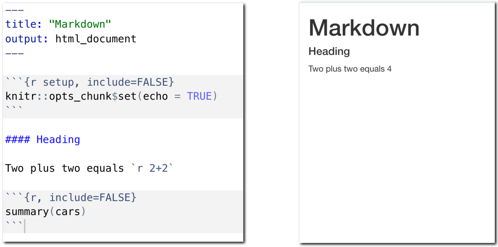
</p>

]

---

# Setup chunk

.pull-left3[

<ul>
  <li class="m1"><span>The setup chunk affords <high> general settings for all chunks</high>.</span></li>
  <li class="m2"><span>Additional functions assist.</span></li>
</ul>

]

.pull-right6[

<br>
<p align = "center">
  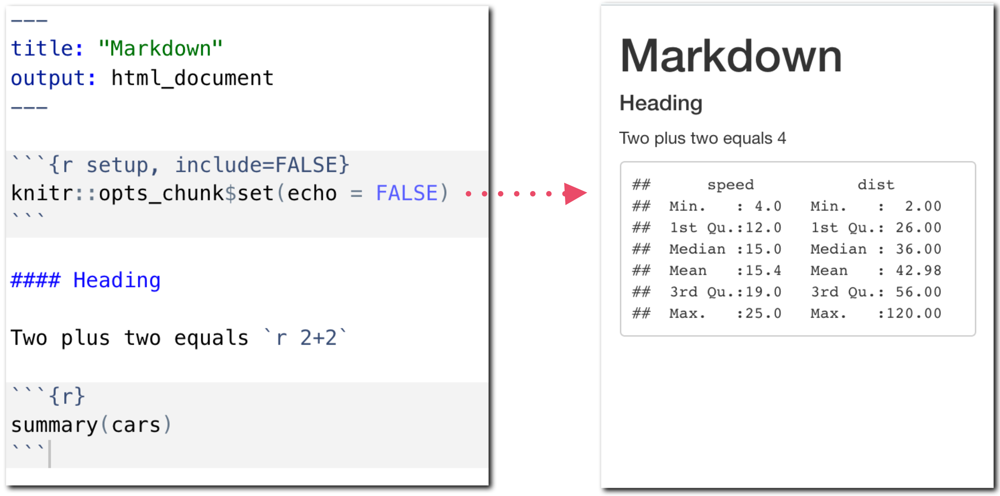
</p>

]

---

# Setup chunk

.pull-left3[

<ul>
  <li class="m1"><span>The setup chunk affords <high> general settings for all chunks</high>.</span></li>
  <li class="m2"><span>Additional functions assist.</span></li>
</ul>

]

.pull-right6[


<p align = "center">
  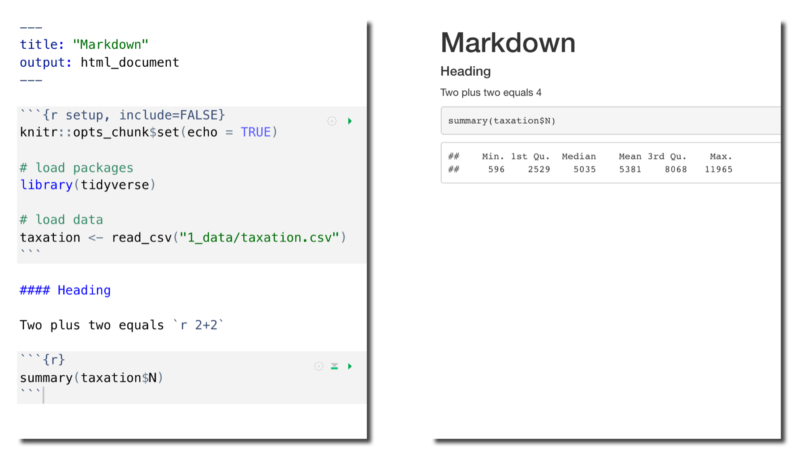
</p>

]


---

# Setup chunk

.pull-left3[

<ul>
  <li class="m1"><span>The setup chunk affords <high> general settings for all chunks</high>.</span></li>
  <li class="m2"><span>Additional functions assist.</span></li>
</ul>

]

.pull-right6[


<p align = "center">
  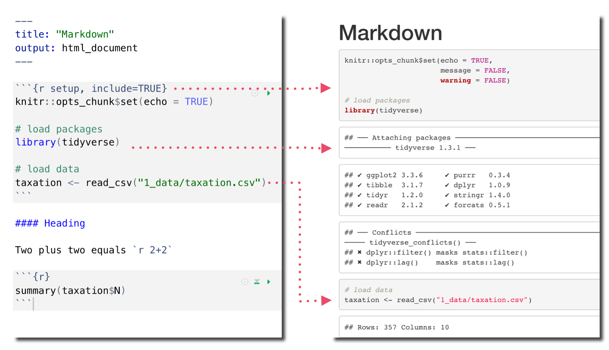
</p>

]


---

# Setup chunk

.pull-left3[

<ul>
  <li class="m1"><span>The setup chunk affords <high> general settings for all chunks</high>.</span></li>
  <li class="m2"><span>Additional functions assist.</span></li>
</ul>

]

.pull-right6[

<p align = "center">
  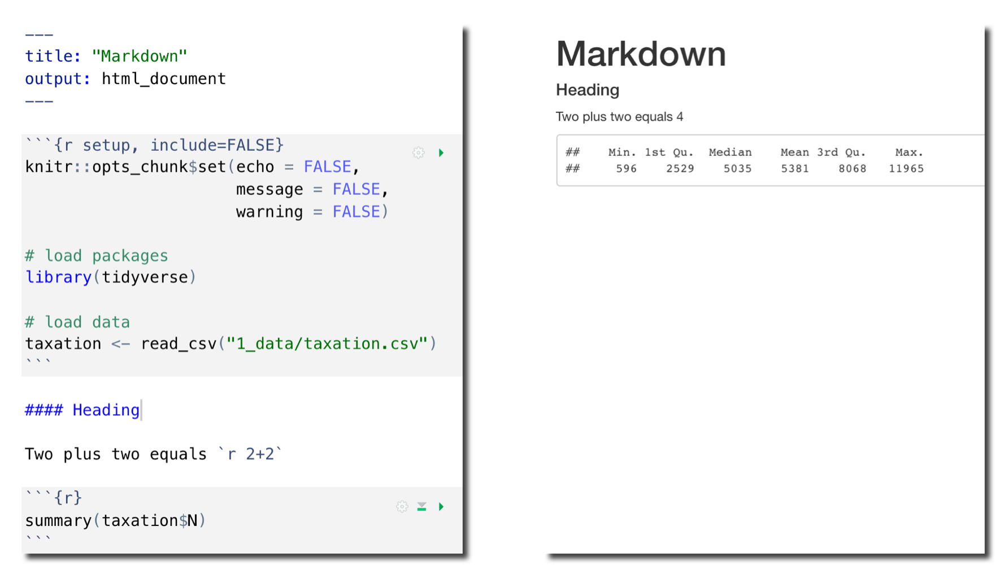
</p>

]


---

# Relative path

.pull-left35[

<ul>
  <li class="m1"><span>When rendered, markdown documents do not use the current <high>working directory</high>.</span></li><br>
  <li class="m2"><span>Paths need to be defined <high>relative to the position of the .Rmd file</high>.</span></li>
</ul>

<br>
```R
# load data
read_csv("../1_data/data.csv")

```

]

.pull-right55[
<br>
<p align = "center">
  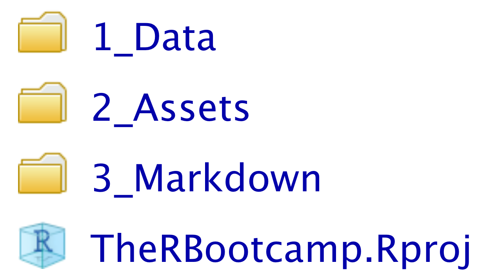
</p>

]


---

.pull-left4[

# Scale graphs

<ul>
  <li class="m1"><span>The general <high>appearance</high> of graphs can be modified in the <mono>chunk</mono>-settings.</span></li> 
  <li class="m2"><span>The arguments (normally) start with  <highm>fig.*</highm>.</span></li> 
</ul>

<table style="cellspacing:0; cellpadding:0; border:none; padding-top:10px" width=100%>
  <col width="40%">
  <col width="60%">
<tr>
  <td bgcolor="white">
    <b>Argument</b>
  </td>
  <td bgcolor="white">
    <b>Description</b>
  </td> 
</tr>
<tr>
  <td bgcolor="white">
  <mono>fig.width</mono>, <mono>fig.height</mono>
  </td>
  <td bgcolor="white">
  <high>Width</high> and <high>height</high> in inches.
  </td> 
</tr>
<tr>
  <td bgcolor="white">
  <mono>fig.asp</mono>
  </td>
  <td bgcolor="white">
   <high>Aspect ratio</high>: Height relative to width.   
  </td> 
</tr>
<tr>
  <td bgcolor="white">
  <mono>fig.align</mono>
  </td>
  <td bgcolor="white">
  <high>Position</high> of the graph: <mono>'center'</mono>, <mono>'left'</mono>, <mono>'right'</mono>.
  </td> 
</tr>
<tr>
  <td bgcolor="white">
  <mono>dpi</mono> 
  </td>
  <td bgcolor="white">
  <high>Resolution</high> of the graph (dots per inch).
  </td> 
</tr>
</table>
]

.pull-right5[
<br>
<p align = "center">
  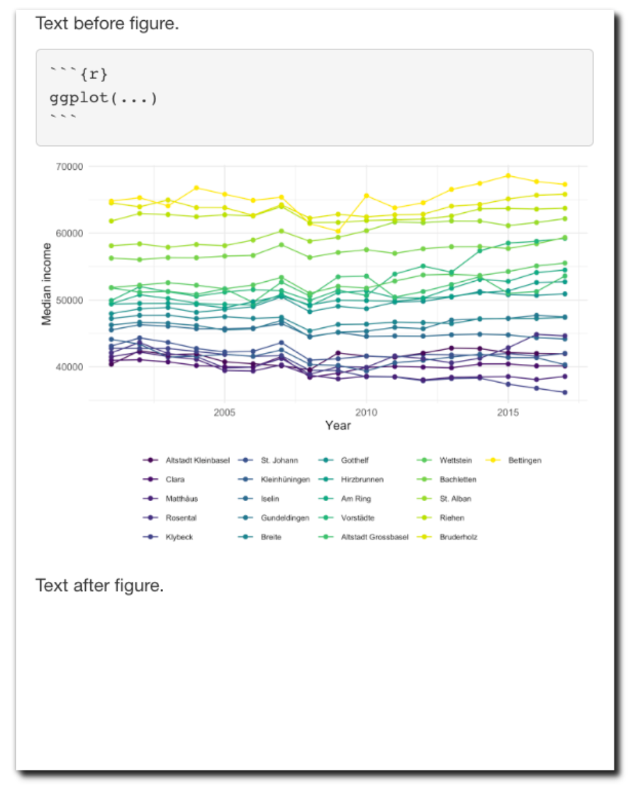
</p>

]

---

.pull-left4[

# Scale graphs

<ul>
  <li class="m1"><span>The general <high>appearance</high> of graphs can be modified in the <mono>chunk</mono>-settings.</span></li> 
  <li class="m2"><span>The arguments (normally) start with  <highm>fig.*</highm>.</span></li> 
</ul>

<table style="cellspacing:0; cellpadding:0; border:none; padding-top:10px" width=100%>
  <col width="40%">
  <col width="60%">
<tr>
  <td bgcolor="white">
    <b>Argument</b>
  </td>
  <td bgcolor="white">
    <b>Description</b>
  </td> 
</tr>
<tr>
  <td bgcolor="white">
  <mono>fig.width</mono>, <mono>fig.height</mono>
  </td>
  <td bgcolor="white">
  <high>Width</high> and <high>height</high> in inches.
  </td> 
</tr>
<tr>
  <td bgcolor="white">
  <mono>fig.asp</mono>
  </td>
  <td bgcolor="white">
   <high>Aspect ratio</high>: Height relative to width.   
  </td> 
</tr>
<tr>
  <td bgcolor="white">
  <mono>fig.align</mono>
  </td>
  <td bgcolor="white">
  <high>Position</high> of the graph: <mono>'center'</mono>, <mono>'left'</mono>, <mono>'right'</mono>.
  </td> 
</tr>
<tr>
  <td bgcolor="white">
  <mono>dpi</mono> 
  </td>
  <td bgcolor="white">
  <high>Resolution</high> of the graph (dots per inch).
  </td> 
</tr>
</table>
]


.pull-right5[
<br>
<p align = "center">
  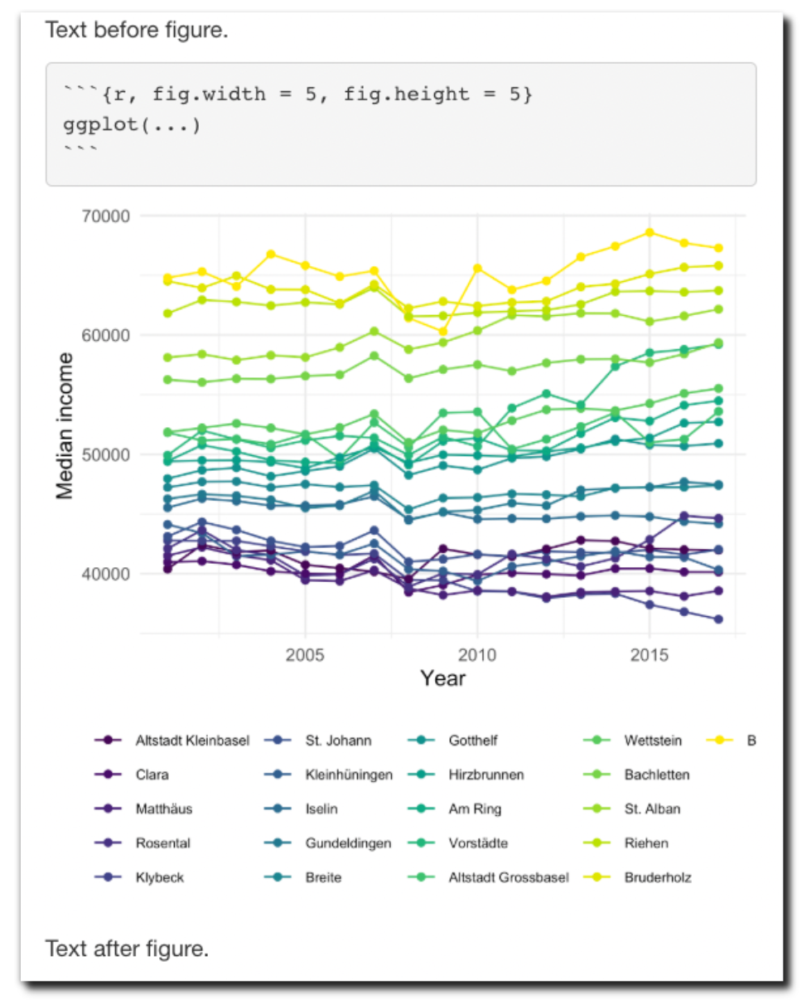
</p>

]

---

.pull-left4[

# Scale graphs

<ul>
  <li class="m1"><span>The general <high>appearance</high> of graphs can be modified in the <mono>chunk</mono>-settings.</span></li> 
  <li class="m2"><span>The arguments (normally) start with  <highm>fig.*</highm>.</span></li> 
</ul>

<table style="cellspacing:0; cellpadding:0; border:none; padding-top:10px" width=100%>
  <col width="40%">
  <col width="60%">
<tr>
  <td bgcolor="white">
    <b>Argument</b>
  </td>
  <td bgcolor="white">
    <b>Description</b>
  </td> 
</tr>
<tr>
  <td bgcolor="white">
  <mono>fig.width</mono>, <mono>fig.height</mono>
  </td>
  <td bgcolor="white">
  <high>Width</high> and <high>height</high> in inches.
  </td> 
</tr>
<tr>
  <td bgcolor="white">
  <mono>fig.asp</mono>
  </td>
  <td bgcolor="white">
   <high>Aspect ratio</high>: Height relative to width.   
  </td> 
</tr>
<tr>
  <td bgcolor="white">
  <mono>fig.align</mono>
  </td>
  <td bgcolor="white">
  <high>Position</high> of the graph: <mono>'center'</mono>, <mono>'left'</mono>, <mono>'right'</mono>.
  </td> 
</tr>
<tr>
  <td bgcolor="white">
  <mono>dpi</mono> 
  </td>
  <td bgcolor="white">
  <high>Resolution</high> of the graph (dots per inch).
  </td> 
</tr>
</table>
]

.pull-right5[
<br>
<p align = "center">
  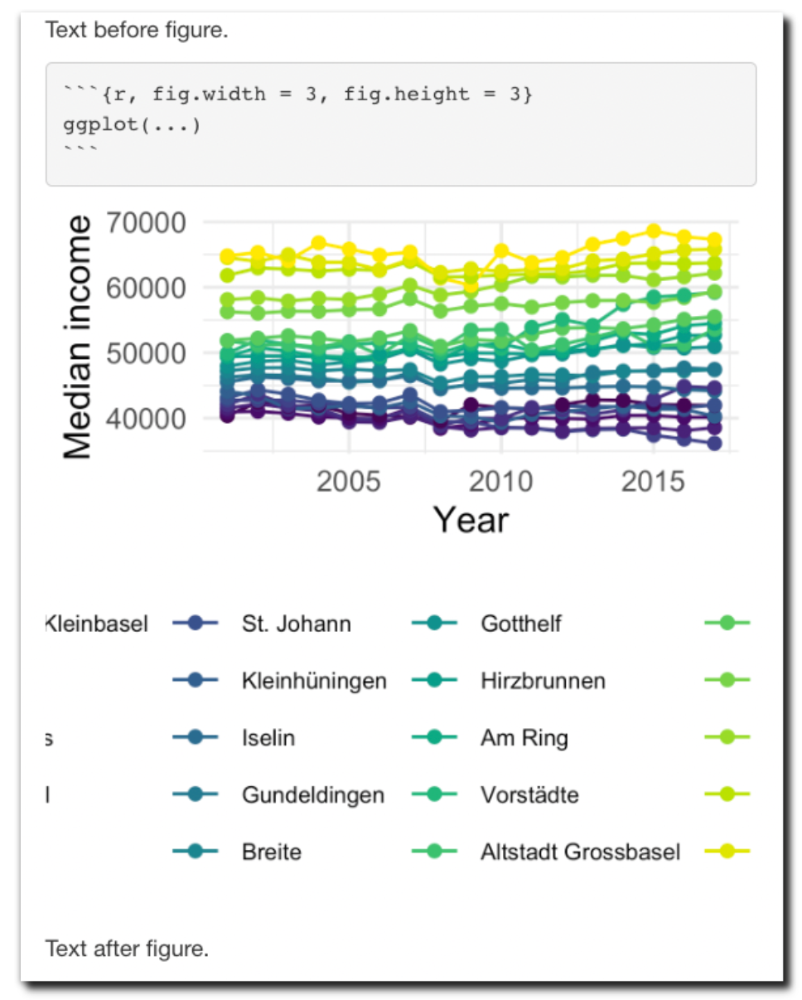
</p>

]

---

.pull-left4[

# Scale graphs

<ul>
  <li class="m1"><span>The general <high>appearance</high> of graphs can be modified in the <mono>chunk</mono>-settings.</span></li> 
  <li class="m2"><span>The arguments (normally) start with  <highm>fig.*</highm>.</span></li> 
</ul>

<table style="cellspacing:0; cellpadding:0; border:none; padding-top:10px" width=100%>
  <col width="40%">
  <col width="60%">
<tr>
  <td bgcolor="white">
    <b>Argument</b>
  </td>
  <td bgcolor="white">
    <b>Description</b>
  </td> 
</tr>
<tr>
  <td bgcolor="white">
  <mono>fig.width</mono>, <mono>fig.height</mono>
  </td>
  <td bgcolor="white">
  <high>Width</high> and <high>height</high> in inches.
  </td> 
</tr>
<tr>
  <td bgcolor="white">
  <mono>fig.asp</mono>
  </td>
  <td bgcolor="white">
   <high>Aspect ratio</high>: Height relative to width.   
  </td> 
</tr>
<tr>
  <td bgcolor="white">
  <mono>fig.align</mono>
  </td>
  <td bgcolor="white">
  <high>Position</high> of the graph: <mono>'center'</mono>, <mono>'left'</mono>, <mono>'right'</mono>.
  </td> 
</tr>
<tr>
  <td bgcolor="white">
  <mono>dpi</mono> 
  </td>
  <td bgcolor="white">
  <high>Resolution</high> of the graph (dots per inch).
  </td> 
</tr>
</table>
]

.pull-right5[
<br>
<p align = "center">
  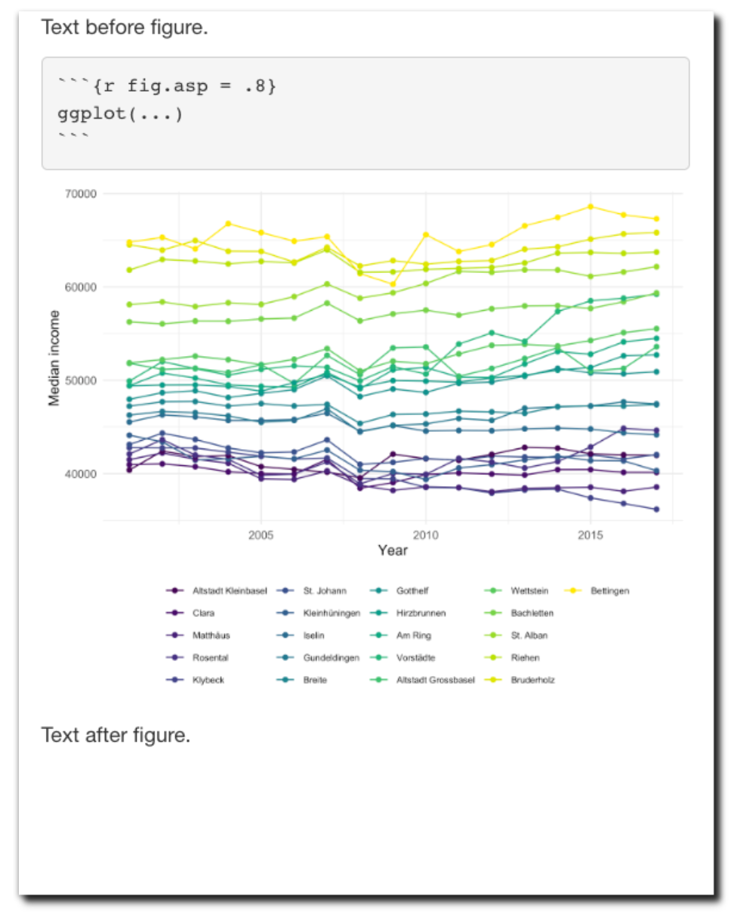
</p>

]

---

.pull-left4[

# Scale graphs

<ul>
  <li class="m1"><span>The general <high>appearance</high> of graphs can be modified in the <mono>chunk</mono>-settings.</span></li> 
  <li class="m2"><span>The arguments (normally) start with  <highm>fig.*</highm>.</span></li> 
</ul>

<table style="cellspacing:0; cellpadding:0; border:none; padding-top:10px" width=100%>
  <col width="40%">
  <col width="60%">
<tr>
  <td bgcolor="white">
    <b>Argument</b>
  </td>
  <td bgcolor="white">
    <b>Description</b>
  </td> 
</tr>
<tr>
  <td bgcolor="white">
  <mono>fig.width</mono>, <mono>fig.height</mono>
  </td>
  <td bgcolor="white">
  <high>Width</high> and <high>height</high> in inches.
  </td> 
</tr>
<tr>
  <td bgcolor="white">
  <mono>fig.asp</mono>
  </td>
  <td bgcolor="white">
   <high>Aspect ratio</high>: Height relative to width.   
  </td> 
</tr>
<tr>
  <td bgcolor="white">
  <mono>fig.align</mono>
  </td>
  <td bgcolor="white">
  <high>Position</high> of the graph: <mono>'center'</mono>, <mono>'left'</mono>, <mono>'right'</mono>.
  </td> 
</tr>
<tr>
  <td bgcolor="white">
  <mono>dpi</mono> 
  </td>
  <td bgcolor="white">
  <high>Resolution</high> of the graph (dots per inch).
  </td> 
</tr>
</table>
]

.pull-right5[
<br>
<p align = "center">
  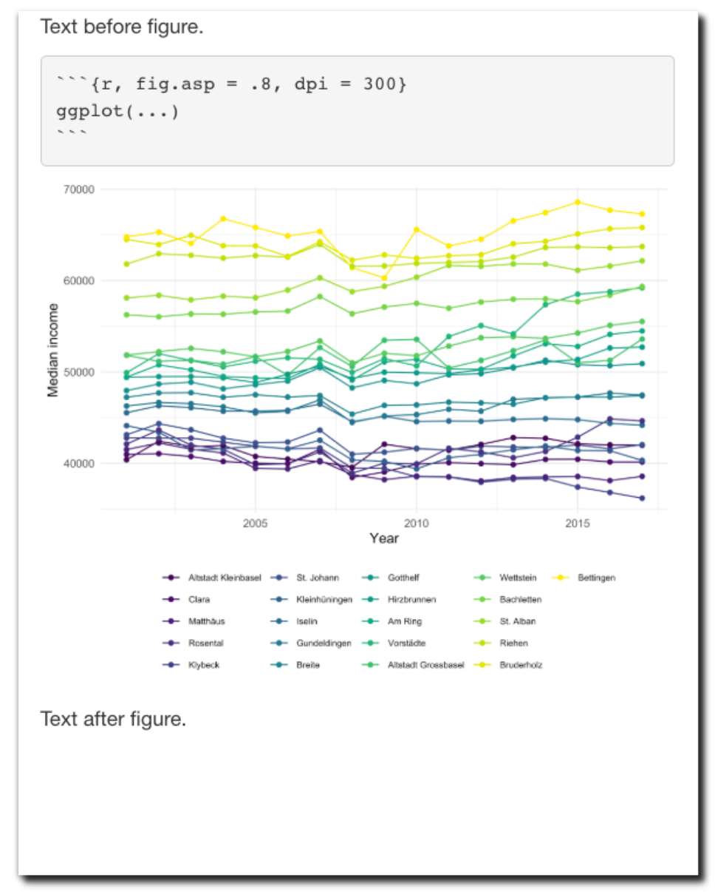
</p>

]


---

.pull-left4[

# Captions

<ul>
  <li class="m1"><span>Captions can be added with  <highm>fig.cap</highm>.</span></li> 
  <li class="m2"><span>The caption text can be defined  <high>within the chunks</high>.</span></li> 
</ul>


]

.pull-right5[
<br>
<p align = "center">
  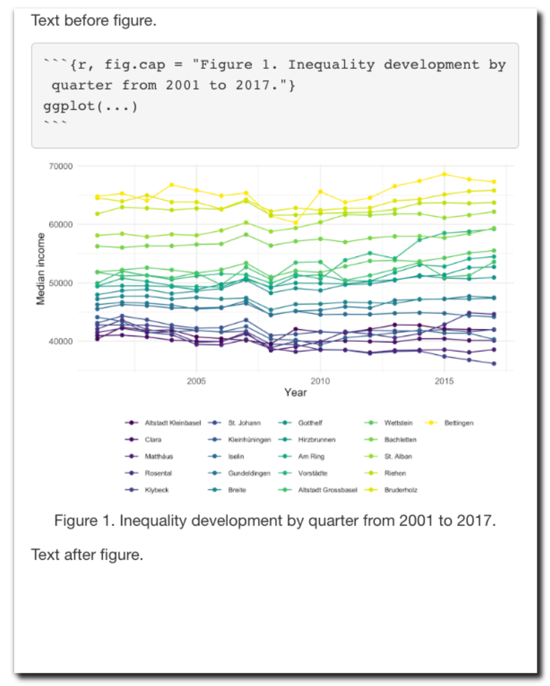
</p>

]


---

.pull-left4[

# Links, footnotes

<ul>
  <li class="m1"><span>There is specific <high>markdown syntax</high> to include links and footnotes.</span></li>
</ul>

<table style="cellspacing:0; cellpadding:0; border:none; padding-top:10px" width=100%>
  <col width="40%">
  <col width="60%">
<tr>
  <td bgcolor="white">
    <b>Markdown</b>
  </td>
  <td bgcolor="white">
    <b>Description</b>
  </td> 
</tr>
<tr>
  <td bgcolor="white">
  <mono>&lsqb;Name&rsqb;(URL)</mono>
  </td>
  <td bgcolor="white">
  <high>Link</high>. Name is displayed in the text, the URL is not displayed.
  </td> 
</tr>
<tr>
  <td bgcolor="white">
  <mono>^&lsqb;Text&rsqb;</mono>
  </td>
  <td bgcolor="white">
   <high>Footnotes</high> are included after the end of the text.    
  </td> 
</tr>
<tr>
  <td bgcolor="white">
  <mono>***</mono>
  </td>
  <td bgcolor="white">
   Includes a <high>horizontal</high> separation line.
  </td> 
</tr>
</table>

]

.pull-right5[
<br><br>
<p align = "center">
  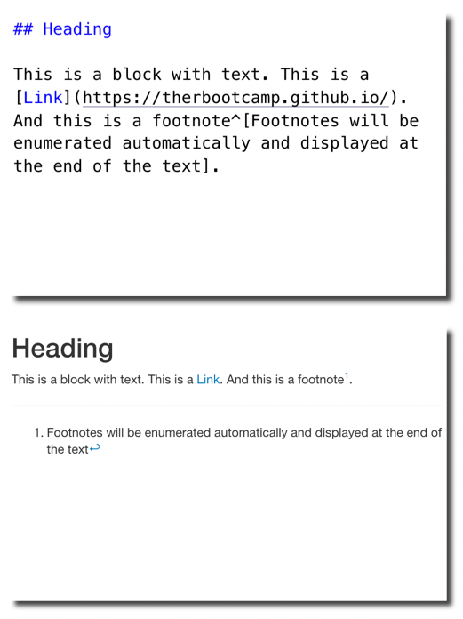
</p>

]

---

.pull-left4[

# Quotes

<ul>
  <li class="m1"><span><high>Quotes</high> are generated directly in Markdown.</span></li>
</ul>

<table style="cellspacing:0; cellpadding:0; border:none; padding-top:10px" width=100%>
  <col width="40%">
  <col width="60%">
<tr>
  <td bgcolor="white">
    <b>Markdown</b>
  </td>
  <td bgcolor="white">
    <b>Description</b>
  </td> 
</tr>
<tr>
  <td bgcolor="white">
  <mono>> block quote</mono>
  </td>
  <td bgcolor="white">
  Text will be displayed as a <high>Quote</high>.<high></high>
  </td> 
</tr>
<tr>
  <td bgcolor="white">
  <mono></mono> 
  </td>
  <td bgcolor="white">
  </td> 
</tr>
<tr>
  <td bgcolor="white">
  <mono></mono>
  </td>
  <td bgcolor="white">
  </td> 
</tr>
</table>

]

.pull-right5[
<br><br>
<p align = "center">
  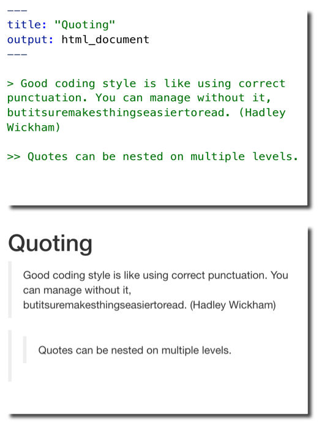
</p>


]


---

.pull-left4[

# YAML

<ul>
  <li class="m1"><span><b>Y</b>AML <b>A</b>'int <b>M</b>arkup <b>L</b>anguage.<span></li>
  <li class="m2"><span>Enables the definition of general <high>properties of a document</high> and code inclusions.<span></li>
</ul>

<table style="cellspacing:0; cellpadding:0; border:none; padding-top:10px" width=100%>
  <col width="40%">
  <col width="60%">
<tr>
  <td bgcolor="white">
    <b>Argument</b>   
  </td>
  <td bgcolor="white">
    <b>Description</b>
  </td> 
</tr>
<tr>
  <td bgcolor="white">
  <mono>toc</mono> 
  </td>
  <td bgcolor="white">
  <b>T</b>able <b>O</b>f <b>C</b>ontents.
  </td> 
</tr>
<tr>
  <td bgcolor="white">
  <mono>toc_depth</mono> 
  </td>
  <td bgcolor="white">
  <high>Depth</high> of the <b>T</b>able <b>O</b>f <b>C</b>ontents.
  </td> 
</tr>
<tr>
  <td bgcolor="white">
  <mono>theme</mono> 
  </td>
  <td bgcolor="white">
  <high>Properties</high> of the layout.
  </td> 
</tr>
<tr>
  <td bgcolor="white">
  <mono>includes</mono> 
  </td>
  <td bgcolor="white">
  <high>Code inclusions</high> before (<mono>before_body</mono>), after (<mono>after_body</mono>) <mono>body</mono>, or <mono>in_header</mono>.
  </td> 
</tr>
</table>

]

.pull-right5[

<br>
<p align = "center">
  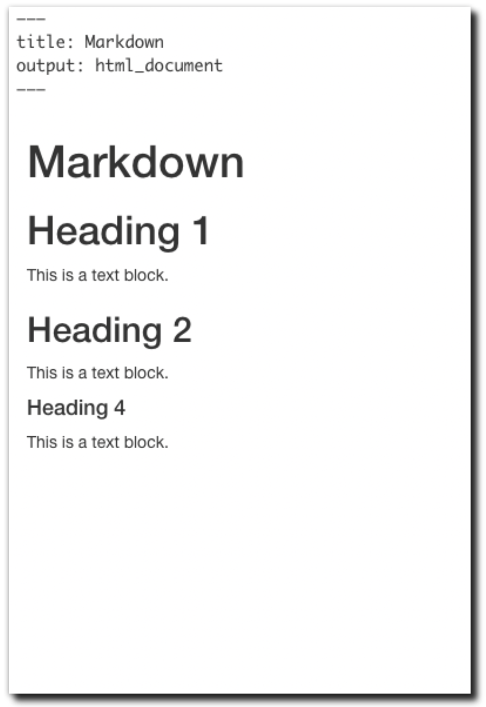
</p>

]


---

.pull-left4[

# YAML

<ul>
  <li class="m1"><span><b>Y</b>AML <b>A</b>'int <b>M</b>arkup <b>L</b>anguage.<span></li>
  <li class="m2"><span>Enables the definition of general <high>properties of a document</high> and code inclusions.<span></li>
</ul>

<table style="cellspacing:0; cellpadding:0; border:none; padding-top:10px" width=100%>
  <col width="40%">
  <col width="60%">
<tr>
  <td bgcolor="white">
    <b>Argument</b>   
  </td>
  <td bgcolor="white">
    <b>Description</b>
  </td> 
</tr>
<tr>
  <td bgcolor="white">
  <mono>toc</mono> 
  </td>
  <td bgcolor="white">
  <b>T</b>able <b>O</b>f <b>C</b>ontents.
  </td> 
</tr>
<tr>
  <td bgcolor="white">
  <mono>toc_depth</mono> 
  </td>
  <td bgcolor="white">
  <high>Depth</high> of the <b>T</b>able <b>O</b>f <b>C</b>ontents.
  </td> 
</tr>
<tr>
  <td bgcolor="white">
  <mono>theme</mono> 
  </td>
  <td bgcolor="white">
  <high>Properties</high> of the layout.
  </td> 
</tr>
<tr>
  <td bgcolor="white">
  <mono>includes</mono> 
  </td>
  <td bgcolor="white">
  <high>Code inclusions</high> before (<mono>before_body</mono>), after (<mono>after_body</mono>) <mono>body</mono>, or <mono>in_header</mono>.
  </td> 
</tr>
</table>

]

.pull-right5[

<br>
<p align = "center">
  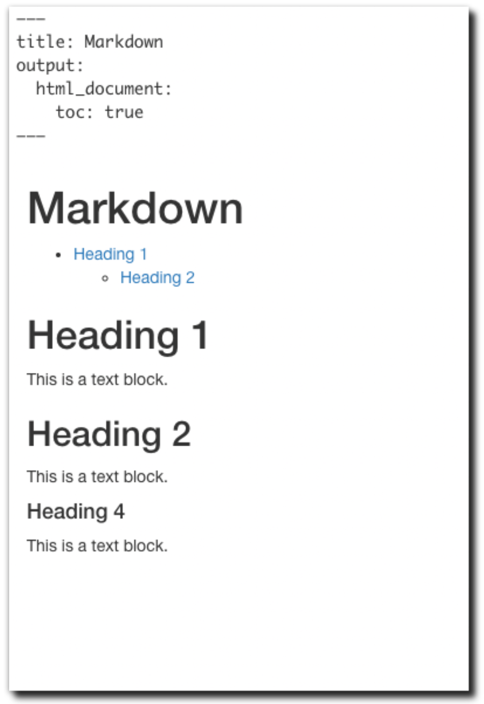
</p>

]

---

.pull-left4[

# YAML

<ul>
  <li class="m1"><span><b>Y</b>AML <b>A</b>'int <b>M</b>arkup <b>L</b>anguage.<span></li>
  <li class="m2"><span>Enables the definition of general <high>properties of a document</high> and code inclusions.<span></li>
</ul>

<table style="cellspacing:0; cellpadding:0; border:none; padding-top:10px" width=100%>
  <col width="40%">
  <col width="60%">
<tr>
  <td bgcolor="white">
    <b>Argument</b>   
  </td>
  <td bgcolor="white">
    <b>Description</b>
  </td> 
</tr>
<tr>
  <td bgcolor="white">
  <mono>toc</mono> 
  </td>
  <td bgcolor="white">
  <b>T</b>able <b>O</b>f <b>C</b>ontents.
  </td> 
</tr>
<tr>
  <td bgcolor="white">
  <mono>toc_depth</mono> 
  </td>
  <td bgcolor="white">
  <high>Depth</high> of the <b>T</b>able <b>O</b>f <b>C</b>ontents.
  </td> 
</tr>
<tr>
  <td bgcolor="white">
  <mono>theme</mono> 
  </td>
  <td bgcolor="white">
  <high>Properties</high> of the layout.
  </td> 
</tr>
<tr>
  <td bgcolor="white">
  <mono>includes</mono> 
  </td>
  <td bgcolor="white">
  <high>Code inclusions</high> before (<mono>before_body</mono>), after (<mono>after_body</mono>) <mono>body</mono>, or <mono>in_header</mono>.
  </td> 
</tr>
</table>

]

.pull-right5[

<br>
<p align = "center">
  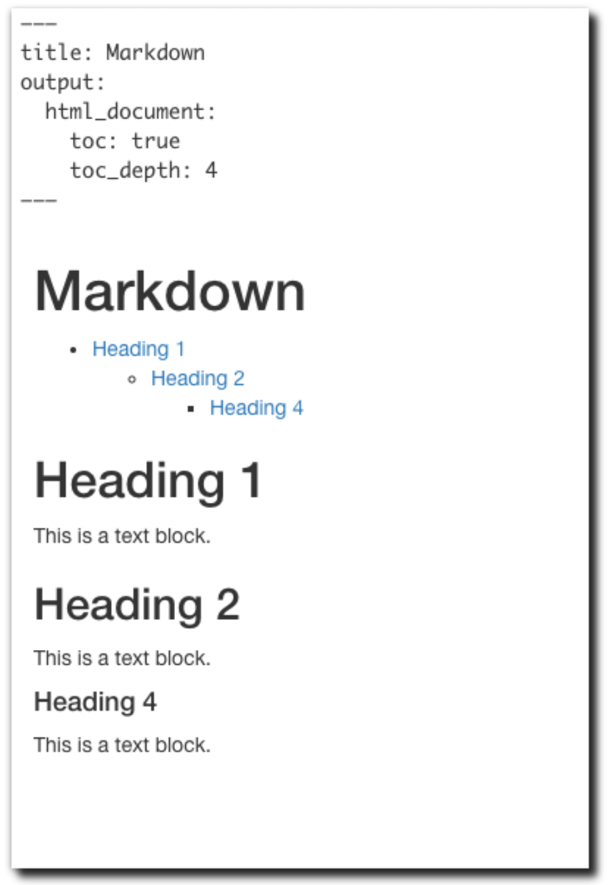
</p>

]

---

.pull-left4[

# YAML

<ul>
  <li class="m1"><span><b>Y</b>AML <b>A</b>'int <b>M</b>arkup <b>L</b>anguage.<span></li>
  <li class="m2"><span>Enables the definition of general <high>properties of a document</high> and code inclusions.<span></li>
</ul>

<table style="cellspacing:0; cellpadding:0; border:none; padding-top:10px" width=100%>
  <col width="40%">
  <col width="60%">
<tr>
  <td bgcolor="white">
    <b>Argument</b>   
  </td>
  <td bgcolor="white">
    <b>Description</b>
  </td> 
</tr>
<tr>
  <td bgcolor="white">
  <mono>toc</mono> 
  </td>
  <td bgcolor="white">
  <b>T</b>able <b>O</b>f <b>C</b>ontents.
  </td> 
</tr>
<tr>
  <td bgcolor="white">
  <mono>toc_depth</mono> 
  </td>
  <td bgcolor="white">
  <high>Depth</high> of the <b>T</b>able <b>O</b>f <b>C</b>ontents.
  </td> 
</tr>
<tr>
  <td bgcolor="white">
  <mono>theme</mono> 
  </td>
  <td bgcolor="white">
  <high>Properties</high> of the layout.
  </td> 
</tr>
<tr>
  <td bgcolor="white">
  <mono>includes</mono> 
  </td>
  <td bgcolor="white">
  <high>Code inclusions</high> before (<mono>before_body</mono>), after (<mono>after_body</mono>) <mono>body</mono>, or <mono>in_header</mono>.
  </td> 
</tr>
</table>

]

.pull-right5[

<br>
<p align = "center">
  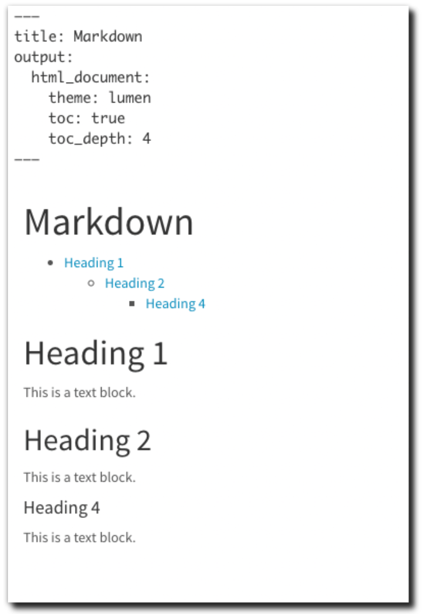
</p>

]

---

.pull-left4[

# YAML

<ul>
  <li class="m1"><span><b>Y</b>AML <b>A</b>'int <b>M</b>arkup <b>L</b>anguage.<span></li>
  <li class="m2"><span>Enables the definition of general <high>properties of a document</high> and code inclusions.<span></li>
</ul>

<table style="cellspacing:0; cellpadding:0; border:none; padding-top:10px" width=100%>
  <col width="40%">
  <col width="60%">
<tr>
  <td bgcolor="white">
    <b>Argument</b>   
  </td>
  <td bgcolor="white">
    <b>Description</b>
  </td> 
</tr>
<tr>
  <td bgcolor="white">
  <mono>toc</mono> 
  </td>
  <td bgcolor="white">
  <b>T</b>able <b>O</b>f <b>C</b>ontents.
  </td> 
</tr>
<tr>
  <td bgcolor="white">
  <mono>toc_depth</mono> 
  </td>
  <td bgcolor="white">
  <high>Depth</high> of the <b>T</b>able <b>O</b>f <b>C</b>ontents.
  </td> 
</tr>
<tr>
  <td bgcolor="white">
  <mono>theme</mono> 
  </td>
  <td bgcolor="white">
  <high>Properties</high> of the layout.
  </td> 
</tr>
<tr>
  <td bgcolor="white">
  <mono>includes</mono> 
  </td>
  <td bgcolor="white">
  <high>Code inclusions</high> before (<mono>before_body</mono>), after (<mono>after_body</mono>) <mono>body</mono>, or <mono>in_header</mono>.
  </td> 
</tr>
</table>

]

.pull-right5[

<br>
<p align = "center">
  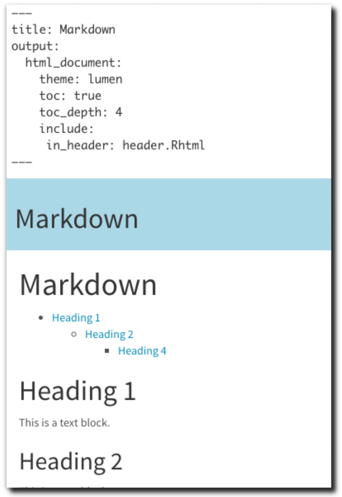
</p>

]

---

.pull-left4[

# YAML

<ul>
  <li class="m1"><span><b>Y</b>AML <b>A</b>'int <b>M</b>arkup <b>L</b>anguage.<span></li>
  <li class="m2"><span>Enables the definition of general <high>properties of a document</high> and code inclusions.<span></li>
</ul>

<table style="cellspacing:0; cellpadding:0; border:none; padding-top:10px" width=100%>
  <col width="40%">
  <col width="60%">
<tr>
  <td bgcolor="white">
    <b>Argument</b>   
  </td>
  <td bgcolor="white">
    <b>Description</b>
  </td> 
</tr>
<tr>
  <td bgcolor="white">
  <mono>toc</mono> 
  </td>
  <td bgcolor="white">
  <b>T</b>able <b>O</b>f <b>C</b>ontents.
  </td> 
</tr>
<tr>
  <td bgcolor="white">
  <mono>toc_depth</mono> 
  </td>
  <td bgcolor="white">
  <high>Depth</high> of the <b>T</b>able <b>O</b>f <b>C</b>ontents.
  </td> 
</tr>
<tr>
  <td bgcolor="white">
  <mono>theme</mono> 
  </td>
  <td bgcolor="white">
  <high>Properties</high> of the layout.
  </td> 
</tr>
<tr>
  <td bgcolor="white">
  <mono>includes</mono> 
  </td>
  <td bgcolor="white">
  <high>Code inclusions</high> before (<mono>before_body</mono>), after (<mono>after_body</mono>) <mono>body</mono>, or <mono>in_header</mono>.
  </td> 
</tr>
</table>

]

.pull-right5[

<br>
<p align = "center">
  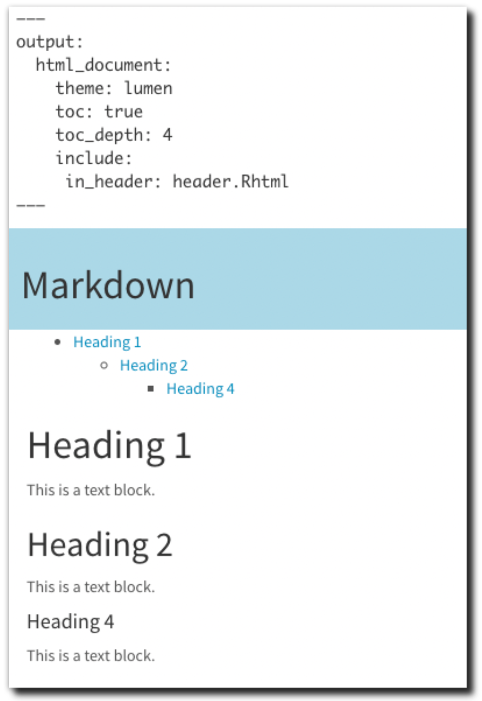
</p>

]

---

.pull-left3[

# HTML


<ul>
  <li class="m1"><span><b>H</b>ypertext <b>M</b>arkup <b>L</b>anguage enables the layout of text and content with <high>HTML-Tags<high>.</span></li> 
  </ul>

<table style="cellspacing:0; cellpadding:0; border:none; padding-top:10px" width=100%>
  <col width="40%">
  <col width="60%">
<tr>
  <td bgcolor="white">
    <b>Tag</b>   
  </td>
  <td bgcolor="white">
    <b>Description</b>
  </td> 
</tr>
<tr>
  <td bgcolor="white">
  <mono>&lt;h1&gt;, &lt;h2&gt,...</mono> </td>
  <td bgcolor="white">
  <high>Heading</high> level 1, 2,...
  </td> 
</tr>
<tr>
  <td bgcolor="white">
  <mono>&lt;br&gt;</mono>
  </td>
  <td bgcolor="white">
   New <high>line</high>.
  </td> 
</tr>
<tr>
  <td bgcolor="white">
  <mono>&lt;b&gt;, &lt;i&gt;, &lt;u&gt;</mono>
  </td>
  <td bgcolor="white">
  <high>Bold, italics, underline.</high>
  </td> 
</tr>
<tr>
  <td bgcolor="white">
  <mono>&lt;div&gt;, &lt;p&gt;</mono> 
  </td>
  <td bgcolor="white">
  <high>Container</high>, text section.
  </td> 
</tr>
<tr>
  <td bgcolor="white">
  <mono>&lt;table&gt;</mono> 
  </td>
  <td bgcolor="white">
  <high>Tables</high>, columns.
  </td> 
</tr>
</table>

]

.pull-right6[

<br>
<p align = "center">
  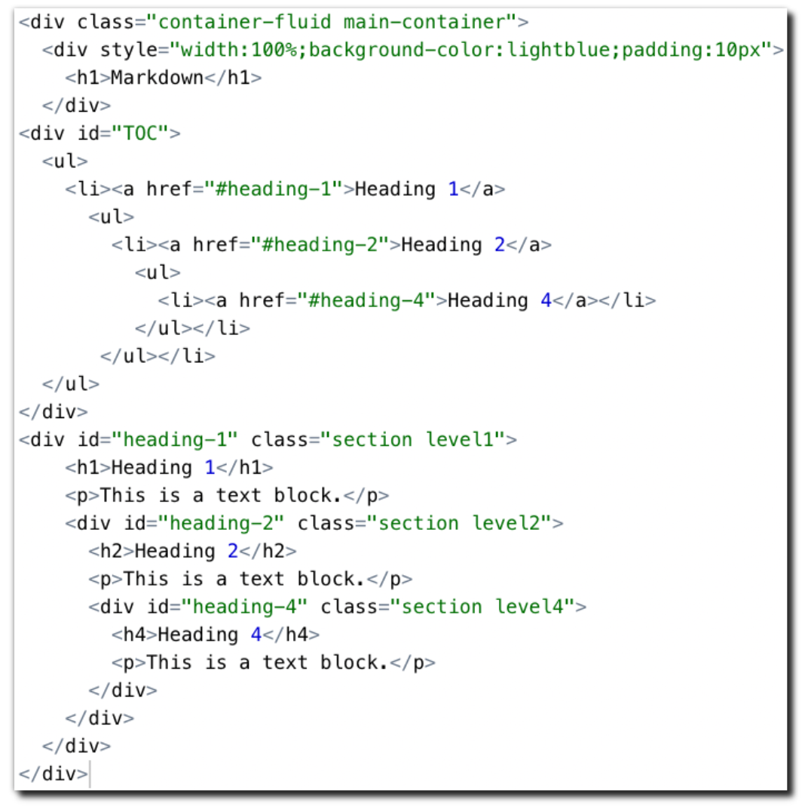
</p>

]

---

.pull-left3[

# CSS

<ul>
  <li class="m1"><span><b>C</b>ascading <b>S</b>tyle <b>S</b>heets allow you to set additional <high>aesthetic characteristics</high> of <high>HTML</high> in an external file.</span></li>
</ul>

]

.pull-right6[

<br><br>
<p align = "center">
  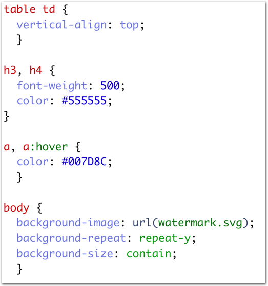
</p>

]

---

class: middle, center

<h1><font style="font-size:12px">click to open</font><br><a href="https://therbootcamp.github.io/DataViz_2022GSERM/_sessions/markdown/markdown_report.html">Practical</a></h1>


