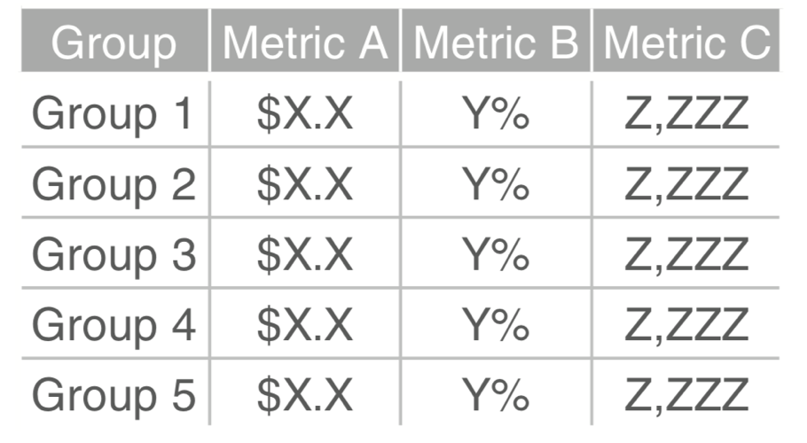
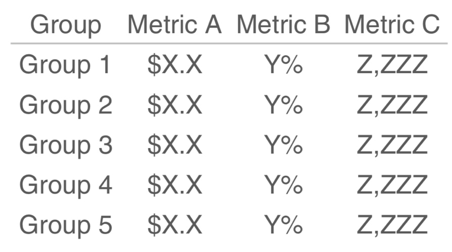
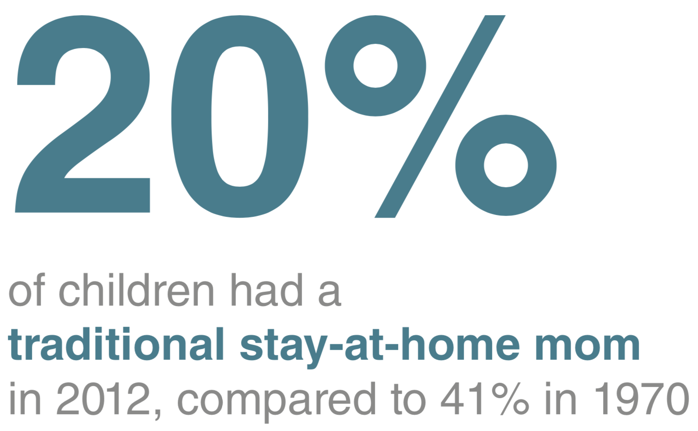

layout: true

<div class="my-footer">
  <span style="text-align:center">
    <span> 
      
    </span>
    <a href="https://therbootcamp.github.io/">
      <span style="padding-left:82px"> 
        <font color="#7E7E7E">
          https://therbootcamp.github.io
        </font>
      </span>
    </a>
    <a href="https://therbootcamp.github.io/">
      <font color="#7E7E7E">
      The R Bootcamp | June 2022
      </font>
    </a>
    </span>
  </div> 

---

```{r, echo = FALSE ,message = FALSE, warning = FALSE}
knitr::opts_chunk$set(comment=NA, fig.width=6, fig.height=6, echo = TRUE, eval = TRUE, 
                      message = FALSE, warning = FALSE, fig.align = 'center', dpi = 200)
library(tidyverse)
library(ggthemes)
library(extrafont)
library(gridExtra)
#loadfonts()
```

# Topics

.pull-left4[

<ul>
  <li class="m1"><span>Context</span></li>
  <br>
  <li class="m2"><span>Cognitive limitations</span></li>
  <ul class="level">
    <li><span>Reduce 'clutter'?</span></li>
    <li><span>Create order</span></li>
    <li><span>Give focus</span></li>
    <li><span>Leverage prior knowledge</span></li>
  </ul>
  <br>
  <li class="m3"><span>Graph types</span></li>
  <ul class="level">
    <li><span>Text, tables, charts</span></li>
    <li><span>Do's and dont's</span></li>
  </ul>
</ul>

]


.pull-right5[

<p align="center">
<br>
<font style="font-size:10px">from <a href="https://www.modernanalyst.com/Resources/BusinessAnalystHumor/tabid/218/ID/3516/Data_Analysis_Conclusions.aspx">modernanalyst.com</a></font>
</p>

]


---

# Topics

.pull-left4[

<ul>
  <li class="m1"><span>Context</span></li>
  <br>
  <li class="m2"><span>Cognitive limitations</span></li>
  <ul class="level">
    <li><span>Reduce 'clutter'?</span></li>
    <li><span>Create order</span></li>
    <li><span>Give focus</span></li>
    <li><span>Leverage prior knowledge</span></li>
  </ul>
  <br>
  <li class="m3"><span>Graph types</span></li>
  <ul class="level">
    <li><span>Text, tables, charts</span></li>
    <li><span>Do's and dont's</span></li>
  </ul>
</ul>

]


.pull-right5[

<p align="center">
<br>
<font style="font-size:10px">from <a href="http://www.storytellingwithdata.com/">storytellingwithdata.com</a></font>
</p>

]


---

# What is the context?

.pull-left4[

<ul>
  <li class="m1"><span>Purpose</span></li>
  <ul class="level">
    <li><span>Exploration</span></li>
    <li><span><high>Explanation</high></span></li>
  </ul>
  <br>
  <li class="m2"><span>Audience</span></li>
  <ul class="level">
    <li><span>Prior knowledge</span></li>
    <li><span>Expectations</span></li>
  </ul>
</ul>

]

.pull-right5[

<p align="center">
<br>
<font style="font-size:10px">from <a href="">upbeatagency.com</a></font>
</p>

]

---

# Cognitive limitations

.pull-left4[

<ul>
  <li class="m1"><span><high>Memory-</high> and <high>attention span</high> of humans are limited.</span></li><br>
  <li class="m2"><span>Information processing is strongly influenced by:</span></li>
  <ul class="level">
    <span><li><high>Top-down</high>: expectations and prior knowledge</span></li>
    <span><li><high>Bottom-up</high>: visual characteristica</li></span>
  </ul>
  </span></li>
</ul>

]

.pull-right5[
<p align="center">
<br>
<font style="font-size:10px">from <a href="https://www.pinterest.de/pin/458311699553074413/?lp=true">pinterest.de</a></font>
</p>
]

---

# Cognitive limitations

.pull-left4[

<ul>
  <li class="m1"><span><high>Memory-</high> and <high>attention span</high> of humans are limited.</span></li><br>
  <li class="m2"><span>Information processing is strongly influenced by:</span></li>
  <ul class="level">
    <span><li><high>Top-down</high>: expectations and prior knowledge</span></li>
    <span><li><high>Bottom-up</high>: visual characteristics</li></span>
  </ul>
  </span></li>
</ul>

]

.pull-right5[
<p align="center">
<br>
</p>
]

---

# Cognitive limitations

.pull-left4[

<ul>
  <li class="m1"><span><high>Memory-</high> and <high>attention span</high> of humans are limited.</span></li><br>
  <li class="m2"><span>Information processing is strongly influenced by:</span></li>
  <ul class="level">
    <span><li><high>Top-down</high>: expectations and prior knowledge</span></li>
    <span><li><high>Bottom-up</high>: visual characteristics</li></span>
  </ul>
  </span></li>
</ul>

]

.pull-right5[
<p align="center">
<br>
<font style="font-size:10px">adapted from <a href="http://www.storytellingwithdata.com/">storytellingwithdata.com</a></font>
</p>
]


---

# Cognitive limitations

.pull-left4[

<ul>
  <li class="m1"><span><high>Memory-</high> and <high>attention span</high> of humans are limited.</span></li><br>
  <li class="m2"><span>Information processing is strongly influenced by:</span></li>
  <ul class="level">
    <span><li><high>Top-down</high>: expectations and prior knowledge</span></li>
    <span><li><high>Bottom-up</high>: visual characteristics</li></span>
  </ul>
  </span></li>
</ul>

]

.pull-right5[
<p align="center">
<br>
<font style="font-size:10px">adapted from <a href="http://www.storytellingwithdata.com/">storytellingwithdata.com</a></font>
</p>
]


---

# Reduce 'clutter'

.pull-left3[

<ul>
  <li class="m1"><span>Remove all <high>unnecessary</high> elements.</span></li>
  <li class="m2"><span><high>Empty spaces</high> in visualizations are as important as pauses in speaking.</span></li>
</ul>

]

.pull-right6[
<p align="center">
<br>
<font style="font-size:10px">adapted from <a href="http://www.storytellingwithdata.com/">storytellingwithdata.com</a></font>
</p>
]

---

# Reduce 'clutter'

.pull-left3[

<ul>
  <li class="m1"><span>Remove all <high>unnecessary</high> elements.</span></li>
  <li class="m2"><span><high>Empty spaces</high> in visualizations are as important as pauses in speaking.</span></li>
</ul>

]

.pull-right6[
<p align="center">
<br>
<font style="font-size:10px">adapted from <a href="http://www.storytellingwithdata.com/">storytellingwithdata.com</a></font>
</p>
]

---

# Reduce 'clutter'

.pull-left3[

<ul>
  <li class="m1"><span>Remove all <high>unnecessary</high> elements.</span></li>
  <li class="m2"><span><high>Empty spaces</high> in visualizations are as important as pauses in speaking.</span></li>
</ul>

]

.pull-right6[
<p align="center">
<br>
<font style="font-size:10px">adapted from <a href="http://www.storytellingwithdata.com/">storytellingwithdata.com</a></font>
</p>
]


---

# Create order

.pull-left3[
<ul>
  <li class="m1"><span>Align elements along <high>implicit lines</high>.</span></li>
  <li class="m2"><span>Again: <high>Empty spaces</high> in visualizations are as important as pauses in speaking.</span></li>
</ul>
]

.pull-right6[
<p align="center">
<br>
<font style="font-size:10px">adapted from <a href="http://www.storytellingwithdata.com/">storytellingwithdata.com</a></font>
</p>
]

---

# Create order

.pull-left3[
<ul>
  <li class="m1"><span>Align elements along <high>implicit lines</high>.</span></li>
  <li class="m2"><span>Again: <high>Empty spaces</high> in visualizations are as important as pauses in speaking.</span></li>
</ul>
]

.pull-right6[
<p align="center">
<br>
<font style="font-size:10px">adapted from <a href="http://www.storytellingwithdata.com/">storytellingwithdata.com</a></font>
</p>
]

---

# Give focus

.pull-left3[
<ul>
  <li class="m1"><span>Use <high>few colors</high> and use them <high>strategically</high> (applies also to contrast).</span></li>
  <br>
  <li class="m2"><span>Choose colors that are <high>appropriate</high> and <high>pleasing</high>.</span></li>
  <ul class="level">
    <li><span>Tools: <a href="https://color.adobe.com/de/create">color.adobe.com</a> oder <a href="https://coolors.co/">coolors.co</a></span></li>
    <li><span>Farbsätze: <a href="https://cran.r-project.org/web/packages/viridis/vignettes/intro-to-viridis.html">viridis</a></span></li>
  </ul>
  <br>
  <li class="m3"><span>Be <high>consistent</high>.</span></li>
</ul>

]

.pull-right6[
<p align="center">
<br>
<font style="font-size:10px">adapted from <a href="http://www.storytellingwithdata.com/">storytellingwithdata.com</a></font>
</p>
]

---

# Give focus

.pull-left3[
<ul>
  <li class="m1"><span>Use <high>few colors</high> and use them <high>strategically</high> (applies also to contrast).</span></li>
  <br>
  <li class="m2"><span>Choose colors that are <high>appropriate</high> and <high>pleasing</high>.</span></li>
  <ul class="level">
    <li><span>Tools: <a href="https://color.adobe.com/de/create">color.adobe.com</a> oder <a href="https://coolors.co/">coolors.co</a></span></li>
    <li><span>Farbsätze: <a href="https://cran.r-project.org/web/packages/viridis/vignettes/intro-to-viridis.html">viridis</a></span></li>
  </ul>
  <br>
  <li class="m3"><span>Be <high>consistent</high>.</span></li>
</ul>

]

.pull-right6[
<p align="center">
<br>
<font style="font-size:10px">adapted from <a href="http://www.storytellingwithdata.com/">storytellingwithdata.com</a></font>
</p>
]


---

# Give focus

.pull-left3[
<ul>
  <li class="m1"><span>Use <high>few colors</high> and use them <high>strategically</high> (applies also to contrast).</span></li>
  <br>
  <li class="m2"><span>Choose colors that are <high>appropriate</high> and <high>pleasing</high>.</span></li>
  <ul class="level">
    <li><span>Tools: <a href="https://color.adobe.com/de/create">color.adobe.com</a> oder <a href="https://coolors.co/">coolors.co</a></span></li>
    <li><span>Farbsätze: <a href="https://cran.r-project.org/web/packages/viridis/vignettes/intro-to-viridis.html">viridis</a></span></li>
  </ul>
  <br>
  <li class="m3"><span>Be <high>consistent</high>.</span></li>
</ul>

]

.pull-right6[
<p align="center">
<br>
<font style="font-size:10px">see <a href="https://color.adobe.com/de/create">color.adobe.com</a></font>
</p>
]

---

# Give focus

.pull-left3[
<ul>
  <li class="m1"><span>Use <high>few colors</high> and use them <high>strategically</high> (applies also to contrast).</span></li>
  <br>
  <li class="m2"><span>Choose colors that are <high>appropriate</high> and <high>pleasing</high>.</span></li>
  <ul class="level">
    <li><span>Tools: <a href="https://color.adobe.com/de/create">color.adobe.com</a> oder <a href="https://coolors.co/">coolors.co</a></span></li>
    <li><span>Farbsätze: <a href="https://cran.r-project.org/web/packages/viridis/vignettes/intro-to-viridis.html">viridis</a></span></li>
  </ul>
  <br>
  <li class="m3"><span>Be <high>consistent</high>.</span></li>
</ul>

]

.pull-right6[
<p align="center">
<br>
<font style="font-size:10px">see <a href="https://coolors.co/">coolors.co</a></font>
</p>
]

---

# Text chart

.pull-left3[

<ul>
  <li class="m1"><span>If it is about a single number, present it as text.</span></li>
</ul>

]


.pull-right6[
<p align="center">
<br>
<font style="font-size:10px">adapted from <a href="http://www.storytellingwithdata.com/">storytellingwithdata.com</a></font>
</p>

]

---

# Tables

.pull-left3[

<ul>
  <li class="m1"><span>Are <high>precise</high> and complete.</span></li>
  <li class="m2"><span>Are <high>processed serially</high> and need time.</span></li>
  <li class="m3"><span><high>Decluttered tables</high> are easier to read.</span></li>
  <li class="m4"><span><high>Colors</high> can help with giving focus.</span></li>
</ul>
]


.pull-right6[
<p align="center">
<br>
<font style="font-size:10px">adapted from <a href="http://www.storytellingwithdata.com/">storytellingwithdata.com</a></font>
</p>

]

---

# Charts

.pull-left3[

<ul>
  <li class="m1"><span>Are <high>processed in parallel</high>.</span></li>
  <li class="m2"><span>Are often <high>easier to understand</high> than tables.</span></li>
  <li class="m3"><span>Are often <high>more difficult to create</high> than tables.</span></li>
</ul>

]


.pull-right6[
<p align="center">
<br>
<font style="font-size:10px">adapted from <a href="http://www.storytellingwithdata.com/">storytellingwithdata.com</a></font>
</p>

]

---

# Annotation

.pull-left3[

<ul>
  <li class="m1"><span>Annotation is <high>very important</high></span></li>
  <li class="m2"><span>Always useful:</span></li>
  <ul class="level">
    <li><span>Axes titles</span></li>
  </ul>
  <br>
  <li class="m3"><span>Mostly useful:</span></li>
  <ul class="level">
    <li><span>Plot title</span></li>
  </ul>
  <br>
  <li class="m4"><span>Often useful:</span></li>
  <ul class="level">
    <li><span>Subtitle</span></li>
    <li><span>Legend</span></li>
    <li><span>Annotations in the plot</span></li>
  </ul>
</ul>

]


.pull-right6[
<p align="center">

<br>
<font style="font-size:10px">adapted from <a href="http://www.storytellingwithdata.com/">storytellingwithdata.com</a></font>
</p>

]


---

class: middle, center

<h1><a href="">Practical</a><br>What's wrong with this?</h1>


---

<br>
<p align="center">

<br>
<font style="font-size:10px">adapted from <a href="https://openknowledge.worldbank.org/handle/10986/13330">World Bank</a></font>
</p>


---

<br>
<p align="center">

<br>
<font style="font-size:10px">from <a href="https://www.hardingcenter.de/sites/default/files/2021-05/DE_mRNA-Impfung_Begleittext.pdf">Harding Center for Risk Literacy</a></font>
</p>


