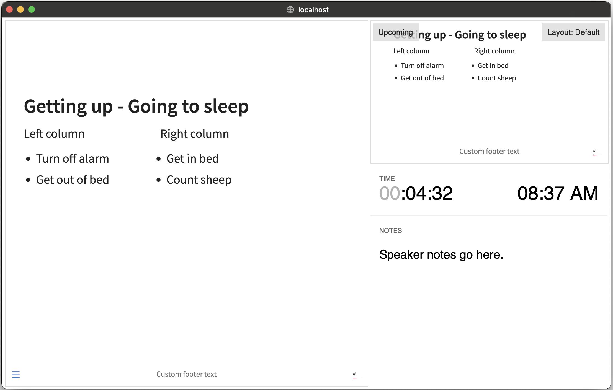
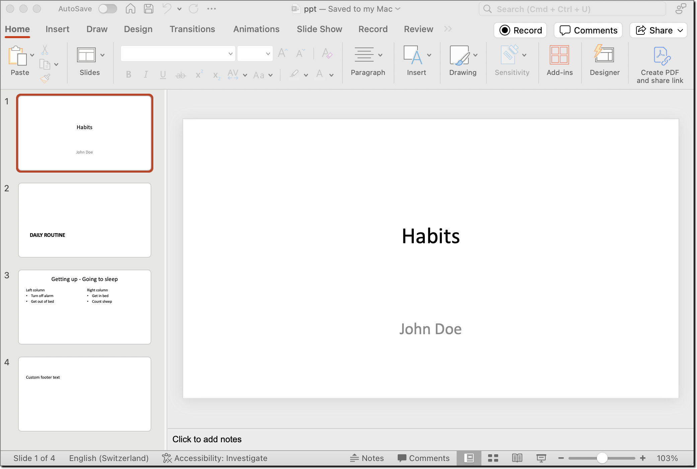

layout: true

<div class="my-footer">
  <span style="text-align:center">
    <span> 
      
    </span>
    <a href="https://therbootcamp.github.io/">
      <span style="padding-left:82px"> 
        <font color="#7E7E7E">
          https://therbootcamp.github.io
        </font>
      </span>
    </a>
    <a href="https://therbootcamp.github.io/">
      <font color="#7E7E7E">
      The R Bootcamp | June 2024
      </font>
    </a>
    </span>
  </div> 

---

```{r setup, include=FALSE}
options(htmltools.dir.version = FALSE)
options(width = 110)
options(digits = 4)

# Load packages
require(tidyverse)
library(leaflet)
library(plotly)

# load color set
source("../../_materials/palette/therbootcamp_palettes.R")

# knitr options
knitr::opts_chunk$set(dpi = 300, echo = FALSE, warning = FALSE, fig.align = 'center', message= FALSE)

# special print function: avoid if possible
print2 <- function(x, nlines=10,...) {
   cat(head(capture.output(print(x,...)), nlines), sep="\n")}

basel <- read_csv("1_data/taxation.csv")

```


.pull-left4[

# Images

<ul>
  <li class="m1"><span>There is specific <high>markdown syntax</high> to include images.</span></li>
</ul>

<table style="cellspacing:0; cellpadding:0; border:none; padding-top:10px" width=100%>
  <col width="50%">
  <col width="50%">
<tr>
  <td bgcolor="white">
    <b>Markdown</b>
  </td>
  <td bgcolor="white">
    <b>Description</b>
  </td> 
</tr>
<tr>
  <td bgcolor="white">
  <mono>!&lsqb;Caption&rsqb;(Filename)</mono>
  </td>
  <td bgcolor="white">
  <high>Caption</high> is displayed below the image.
  </td> 
</tr>
<tr>
  <td bgcolor="white">
  <mono>{width=XX}</mono>
  </td>
  <td bgcolor="white">
   Changing <high>width</high> with measure in px, in or %.    
  </td> 
</tr>
<tr>
  <td bgcolor="white">
  <mono>{fig-align="XX"}</mono>
  </td>
  <td bgcolor="white">
   Define <high>alignment</high> with 'left', 'right' and 'center'.    
  </td> 
</tr>
<tr>
  <td bgcolor="white">
  <mono>{.lightbox}</mono>
  </td>
  <td bgcolor="white">
   In HTML add lightbox to allow  <high>zooming</high> into the image upon clicking on it.    
  </td> 
</tr>
</table>

]

.pull-right5[
<br>
<div style="width:100%">
````markdown
---
title: "Quarto"
format:
  html
---


````
</div>
<iframe class="slide-deck" src="example_image/image.html" width = "100%" height = 300></iframe>


]

---

.pull-left4[

# Images

<ul>
  <li class="m1"><span>There is specific <high>markdown syntax</high> to include images.</span></li>
</ul>

<table style="cellspacing:0; cellpadding:0; border:none; padding-top:10px" width=100%>
  <col width="50%">
  <col width="50%">
<tr>
  <td bgcolor="white">
    <b>Markdown</b>
  </td>
  <td bgcolor="white">
    <b>Description</b>
  </td> 
</tr>
<tr>
  <td bgcolor="white">
  <mono>!&lsqb;Caption&rsqb;(Filename)</mono>
  </td>
  <td bgcolor="white">
  <high>Caption</high> is displayed below the image.
  </td> 
</tr>
<tr>
  <td bgcolor="white">
  <mono>{width=XX}</mono>
  </td>
  <td bgcolor="white">
   Changing <high>width</high> with measure in px, in or %.    
  </td> 
</tr>
<tr>
  <td bgcolor="white">
  <mono>{fig-align="XX"}</mono>
  </td>
  <td bgcolor="white">
   Define <high>alignment</high> with 'left', 'right' and 'center'.    
  </td> 
</tr>
<tr>
  <td bgcolor="white">
  <mono>{.lightbox}</mono>
  </td>
  <td bgcolor="white">
   In HTML add lightbox to allow  <high>zooming</high> into the image upon clicking on it.    
  </td> 
</tr>
</table>

]

.pull-right5[
<br>
<div style="width:100%">
````markdown
---
title: "Quarto"
format:
  html
---

{width='30%'}
````
</div>
<iframe class="slide-deck" src="example_image_size/image.html" width = "100%" height = 300></iframe>


]

---

.pull-left4[

# Images

<ul>
  <li class="m1"><span>There is specific <high>markdown syntax</high> to include images.</span></li>
</ul>

<table style="cellspacing:0; cellpadding:0; border:none; padding-top:10px" width=100%>
  <col width="50%">
  <col width="50%">
<tr>
  <td bgcolor="white">
    <b>Markdown</b>
  </td>
  <td bgcolor="white">
    <b>Description</b>
  </td> 
</tr>
<tr>
  <td bgcolor="white">
  <mono>!&lsqb;Caption&rsqb;(Filename)</mono>
  </td>
  <td bgcolor="white">
  <high>Caption</high> is displayed below the image.
  </td> 
</tr>
<tr>
  <td bgcolor="white">
  <mono>{width=XX}</mono>
  </td>
  <td bgcolor="white">
   Changing <high>width</high> with measure in px, in or %.    
  </td> 
</tr>
<tr>
  <td bgcolor="white">
  <mono>{fig-align="XX"}</mono>
  </td>
  <td bgcolor="white">
   Define <high>alignment</high> with 'left', 'right' and 'center'.    
  </td> 
</tr>
<tr>
  <td bgcolor="white">
  <mono>{.lightbox}</mono>
  </td>
  <td bgcolor="white">
   In HTML add lightbox to allow  <high>zooming</high> into the image upon clicking on it.    
  </td> 
</tr>
</table>

]

.pull-right5[
<br>
<div style="width:100%">
````markdown
---
title: "Quarto"
format:
  html
---

{width='30%' fig-align='left'}
````
</div>
<iframe class="slide-deck" src="example_image_position/image.html" width = "100%" height = 300></iframe>


]

---

.pull-left4[

# Images

<ul>
  <li class="m1"><span>There is specific <high>markdown syntax</high> to include images.</span></li>
</ul>

<table style="cellspacing:0; cellpadding:0; border:none; padding-top:10px" width=100%>
  <col width="50%">
  <col width="50%">
<tr>
  <td bgcolor="white">
    <b>Markdown</b>
  </td>
  <td bgcolor="white">
    <b>Description</b>
  </td> 
</tr>
<tr>
  <td bgcolor="white">
  <mono>!&lsqb;Caption&rsqb;(Filename)</mono>
  </td>
  <td bgcolor="white">
  <high>Caption</high> is displayed below the image.
  </td> 
</tr>
<tr>
  <td bgcolor="white">
  <mono>{width=XX}</mono>
  </td>
  <td bgcolor="white">
   Changing <high>width</high> with measure in px, in or %.    
  </td> 
</tr>
<tr>
  <td bgcolor="white">
  <mono>{fig-align="XX"}</mono>
  </td>
  <td bgcolor="white">
   Define <high>alignment</high> with 'left', 'right' and 'center'.    
  </td> 
</tr>
<tr>
  <td bgcolor="white">
  <mono>{.lightbox}</mono>
  </td>
  <td bgcolor="white">
   In HTML add lightbox to allow  <high>zooming</high> into the image upon clicking on it.    
  </td> 
</tr>
</table>

]

.pull-right5[
<br>
<div style="width:100%">
````markdown
---
title: "Quarto"
format:
  html
---


{width='30%' fig-align='left' .lightbox}
````
</div>
<iframe class="slide-deck" src="example_image_light/image.html" width = "100%" height = 300></iframe>

]

---

# Tables

.pull-left4[

Quarto supports custom <high>markdown table</high> output.

<ul>
  <li class="m1"><span><mono>---</mono> indicate the <high>relative width</high> of a column.</li>
  <li class="m2"><span><mono>:</mono> the <high>alignment</high> of a column.</li>
  <li class="m3"><span><mono>{tbl-colwidths='[W,X,Y,Z]'}</mono> set explicit <high>column width.</high></span></li> 
  <li class="m4"><span>Complex <high>sub-table</high> designs are possible.</high></span></li> 
</ul>

]

.pull-right5[

<div style="width:100%">
````markdown
| Default | Left | Right | Center |
|---------|:-----|------:|:------:|
| 12      | 12   |    12 |   12   |
| 123     | 123  |   123 |  123   |
| 1       | 1    |     1 |   1    |

: Simple pipe table syntax
````
</div>
<iframe class="slide-deck" src="example_table/table.html" width = "100%" height = 300></iframe>


]

---

# Tables

.pull-left4[

Quarto supports custom <high>markdown table</high> output.

<ul>
  <li class="m1"><span><mono>---</mono> indicate the <high>relative width</high> of a column.</li>
  <li class="m2"><span><mono>:</mono> the <high>alignment</high> of a column.</li>
  <li class="m3"><span><mono>{tbl-colwidths='[W,X,Y,Z]'}</mono> set explicit <high>column width.</high></span></li> 
  <li class="m4"><span>Complex <high>sub-table</high> designs are possible.</high></span></li> 
</ul>

]

.pull-right5[


<div style="width:100%">
````markdown
| Default | Left | Right | Center |
|---------|:-----|------:|:------:|
| 12      | 12   |    12 |   12   |
| 123     | 123  |   123 |  123   |
| 1       | 1    |     1 |   1    |

: Simple pipe table syntax {tbl-colwidths="[10,10,20,60]"}

````
</div>
<iframe class="slide-deck" src="example_table_col/table.html" width = "100%" height = 300></iframe>


]

---

# Tables

.pull-left4[

Quarto supports custom <high>markdown table</high> output.

<ul>
  <li class="m1"><span><mono>---</mono> indicate the <high>relative width</high> of a column.</li>
  <li class="m2"><span><mono>:</mono> the <high>alignment</high> of a column.</li>
  <li class="m3"><span><mono>{tbl-colwidths='[W,X,Y,Z]'}</mono> set explicit <high>column width.</high></span></li> 
  <li class="m4"><span>Complex <high>sub-table</high> designs are possible.</high></span></li> 
</ul>

]

.pull-right5[


<div style="width:100%">
````markdown
::: {#tbl-panel layout-ncol=1}
| Col1 | Col2 | Col3 |
|------|------|------|
| A    | B    | C    |
| E    | F    | G    |
| A    | G    | G    |

: First Table {#tbl-first}

| Col1 | Col2 | Col3 |
|------|------|------|
| A    | B    | C    |
| E    | F    | G    |
| A    | G    | G    |

: Second Table {#tbl-second}

Main Caption
:::

````
</div>
<br>
]

---

# Tables

.pull-left4[

Quarto supports custom <high>markdown table</high> output.

<ul>
  <li class="m1"><span><mono>---</mono> indicate the <high>relative width</high> of a column.</li>
  <li class="m2"><span><mono>:</mono> the <high>alignment</high> of a column.</li>
  <li class="m3"><span><mono>{tbl-colwidths='[W,X,Y,Z]'}</mono> set explicit <high>column width.</high></span></li> 
  <li class="m4"><span>Complex <high>sub-table</high> designs are possible.</high></span></li> 
</ul>

]

.pull-right5[

<iframe class="slide-deck" src="example_table_sub/table.html" width = "100%" height = "100%"></iframe>


]

---

# Cross referencing

.pull-left4[

Cross references  <high>ease navigation </high> of documents.

<ul>
  <li class="m1"><span>A cross reference consist of a <high>label (#)</high> and <high>referrer (@)</high></span></li>
  <li class="m2"><span>Add label to <high>images</high> with <mono>#fig-label</mono></span>, to <high>tables</high> with <mono>#tbl-label</mono></span></li>
  <li class="m3"><span>Insert referrer in text to <high>Images</high> with <mono>&commat;fig-label</mono></span>, to <high>tables</high> with <mono>&commat;tbl-label</mono></li> </span></li>  
</ul>

]

.pull-right5[

<div style="width:100%">
````markdown
| Default | Left | Right | Center |
|---------|:-----|------:|:------:|
| 12      | 12   |    12 |   12   |
| 123     | 123  |   123 |  123   |
| 1       | 1    |     1 |   1    |

: Simple pipe table syntax {#tbl-pipe}

And then references in text - see @tbl-pipe.
````
</div>
<iframe class="slide-deck" src="example_ref/ref.html" width = "100%" height = 300></iframe>


]

---

# Cross referencing

.pull-left4[

Cross references  <high>ease navigation </high> of documents.

<ul>
  <li class="m1"><span>A cross reference consist of a <high>label (#)</high> and <high>referrer (@)</high></span></li>
  <li class="m2"><span>Add label to <high>images</high> with <mono>#fig-label</mono></span>, to <high>tables</high> with <mono>#tbl-label</mono></span></li>
  <li class="m3"><span>Insert referrer in text to <high>Images</high> with <mono>&commat;fig-label</mono></span>, to <high>tables</high> with <mono>&commat;tbl-label</mono></li> </span></li>  
</ul>

]

.pull-right5[

<div style="width:100%">
````markdown
{width='30%' fig-align='left' #fig-logo} 

As can been seen in @fig-logo.
````
</div>
<iframe class="slide-deck" src="example_image_ref/image_ref.html" width = "100%" height = 300></iframe>


]

---

# Presentations

.pull-left4[
<high>HTML</high> with reveal.js

<ul>
  <li class="m1"><span>Define <high>Sections</high> and <high>Slides</high> using <mono>#</mono>.</span></li>
</ul>

<table style="cellspacing:0; cellpadding:0; border:none; padding-top:20px" width=100%>
  <col width="40%">
  <col width="60%">
<tr>
  <td bgcolor="white">
    <b>Markdown</b>
  </td>
  <td bgcolor="white">
    <b>Description</b>
  </td> 
</tr>
<tr>
  <td bgcolor="white">
  <mono>#</mono>
  </td>
  <td bgcolor="white">
  Add new <high>section</high>
  </td> 
</tr>
<tr>
  <td bgcolor="white">
  <mono>##</mono>
  </td>
  <td bgcolor="white">
  Add new <high>slide</high>
  </td> 
</tr>
<tr>
  <td bgcolor="white">
  <mono>-</mono>
  </td>
  <td bgcolor="white">
  <high>List</high> item
  </td> 
</tr>
<tr>
  <td bgcolor="white">
  <mono>incremental</mono>
  </td>
  <td bgcolor="white">
  <high>stepwise</high> reveal
  </td> 
</tr>
</table>


]

.pull-right5[

<div style="width:70%">
````markdown
---
title: "Habits"
author: "John Doe"
format: revealjs
---

# Daily routine

## Getting up
- Turn off alarm
- Get out of bed

## Going to sleep
- Get in bed
- Count sheep
````
</div>
<iframe class="slide-deck" src="example_presentations/turn_on.html" width = "70%" ></iframe>

]

---

# Presentations

.pull-left4[
<high>HTML</high> with reveal.js

<ul>
  <li class="m1"><span>Define <high>Sections</high> and <high>Slides</high> using <mono>#</mono>.</span></li>
</ul>

<table style="cellspacing:0; cellpadding:0; border:none; padding-top:20px" width=100%>
  <col width="40%">
  <col width="60%">
<tr>
  <td bgcolor="white">
    <b>Markdown</b>
  </td>
  <td bgcolor="white">
    <b>Description</b>
  </td> 
</tr>
<tr>
  <td bgcolor="white">
  <mono>#</mono>
  </td>
  <td bgcolor="white">
  Add new <high>section</high>
  </td> 
</tr>
<tr>
  <td bgcolor="white">
  <mono>##</mono>
  </td>
  <td bgcolor="white">
  Add new <high>slide</high>
  </td> 
</tr>
<tr>
  <td bgcolor="white">
  <mono>-</mono>
  </td>
  <td bgcolor="white">
  <high>List</high> item
  </td> 
</tr>
<tr>
  <td bgcolor="white">
  <mono>incremental</mono>
  </td>
  <td bgcolor="white">
  <high>stepwise</high> reveal
  </td> 
</tr>
</table>

]

.pull-right5[

<div style="width:70%">
````markdown
---
title: "Habits"
author: "John Doe"
format:
  revealjs:
    incremental: true
---

````
</div>
<iframe class="slide-deck" src="example_presentations/incremental.html" width = "70%" height = "250"></iframe>

]

---

# Columns

.pull-left4[

<ul>
  <li class="m1"><span><high>Distribute</high> content with <high>columns</high> <br>defined by fences <mono>::::</mono>.</span></li>
</ul>

<table style="cellspacing:0; cellpadding:0; border:none; padding-top:20px" width=100%>
  <col width="50%">
  <col width="50%">
<tr>
  <td bgcolor="white">
    <b>Markdown</b>
  </td>
  <td bgcolor="white">
    <b>Description</b>
  </td> 
</tr>
<tr>
  <td bgcolor="white">
  <mono><mono>:::: {.column}</mono></mono>
  </td>
  <td bgcolor="white">
  Add <high>columns</high>
  </td> 
</tr>
<tr>
  <td bgcolor="white">
  <mono>::: {.column width="XX%"}</mono>
  </td>
  <td bgcolor="white">
  Set column <high>width</high>
  </td> 
</tr>

</table>

]

.pull-right5[

<div style="width:70%">
````markdown
:::: {.columns}
::: {.column width="40%"}
Left column
- Turn off alarm
- Get out of bed
:::

::: {.column width="60%"}
Right column

- Get in bed
- Count sheep
:::
::::

````
</div>
<iframe class="slide-deck" src="example_presentations/columns.html" width = "70%" ></iframe>

]

---

# Speaker notes

.pull-left4[

<ul>
  <li class="m1"> <span>Add Speaker <high>notes</high> with <mono>{.notes}</mono></span></li> 
  <li class="m2"><span>Press <mono>S</mono> for <high>presentation view</high>.</span></li> 

</ul>

]

.pull-right5[

<div style="width:70%">
````markdown
## Slide with speaker notes

Slide content

::: {.notes}
Speaker notes go here.
:::

````
</div>
<br>

]

---

# Footer & Logo

.pull-left4[

Add information on <high> each slide</high>.

<ul>
  <li class="m1"><span><high>Footer</high> text </span></li> 
  <li class="m2"><span><high>Logo<Logo></span></li> 
  <li class="m3"><span><high>Custom footer</high> per slide </span></li> 

</ul>

]

.pull-right5[

<div style="width:70%">
````markdown
---
format:
  revealjs:
    logo: logo.png
    footer: "University of Bern"
---

````
</div>
<iframe class="slide-deck" src="example_presentations/footer.html" width = "70%" height = "250"></iframe>

]

---

# Footer & Logo

.pull-left4[

Add information on <high> each slide</high>.

<ul>
  <li class="m1"><span><high>Footer</high> text </span></li> 
  <li class="m2"><span><high>Logo<Logo></span></li> 
  <li class="m3"><span><high>Custom footer</high> per slide</span></li> 

</ul>

]

.pull-right5[

<div style="width:70%">
````markdown

---
format:
  revealjs:
    logo: logo.png
    footer: "University of Bern"
---
...

::: footer
Custom footer text
:::

````
</div>
<iframe class="slide-deck" src="example_presentations/footer_custom.html" width = "70%" ></iframe>

]

---

# Aligning text

.pull-left4[

Specific functions to define  <high>position/size</high> of text on a slide.

<ul>
  <li class="m1"><span><mono>.center</mono> text on slide  </span></li> 
  <li class="m2"><span><mono>.r-fit-text</mono> <high>BIG</high> text  </span></li> 

  <li class="m3"><span><mono>.stretch</mono> text between components  </span></li> 
</ul>

]

.pull-right5[

<div style="width:70%">
````markdown
## This is important {.center}

Sleep 7 hours!
````
</div>
<iframe class="slide-deck" src="example_presentations/center.html" width = "70%" height = "250" ></iframe>

]

---

# Aligning text

.pull-left4[

Specific functions to define  <high>position/size</high> of text on a slide.

<ul>
  <li class="m1"><span><mono>.center</mono> text on slide  </span></li> 
  <li class="m2"><span><mono>.r-fit-text</mono> <high>BIG</high> text  </span></li> 

  <li class="m3"><span><mono>.stretch</mono> text between components  </span></li> 
</ul>

]

.pull-right5[

<div style="width:70%">
````markdown
## {.center}

::: {.r-fit-text}
Even more important!
:::
````
</div>
<iframe class="slide-deck" src="example_presentations/BIG.html" width = "70%" height = "250" ></iframe>

]


---

# Aligning text

.pull-left4[

Specific functions to define  <high>position/size</high> of text on a slide.

<ul>
  <li class="m1"><span><mono>.center</mono> text on slide  </span></li> 
  <li class="m2"><span><mono>.r-fit-text</mono> <high>BIG</high> text  </span></li> 

  <li class="m3"><span><mono>.stretch</mono> text between components  </span></li> 
</ul>

]

.pull-right5[

<div style="width:70%">
````markdown
## {.center}

Here is an image:

{.r-stretch}

Some text after the image.
````
</div>
<iframe class="slide-deck" src="example_presentations/stretch.html" width = "70%" height = "250" ></iframe>

]

---

# Adding color

.pull-left4[

Emphasizing with <high>colors</high>.

<ul>
  <li class="m1"><span><mono>[word]{style="color:red"}</mono> for text</span></li> 
  <li class="m2"><span><mono>background-color</mono> for slide</span></li> 
  <li class="m3"><span><mono>data-background-X</mono> to update <high>title slide</high></span></li> 
</ul>

]

.pull-right5[

<div style="width:70%">
````markdown
##

Even [more]{style="color:red"} 
important!

````
</div>
<iframe class="slide-deck" src="example_presentations/color.html" width = "70%" height = "300" ></iframe>

]

---

# Adding color

.pull-left4[

Emphasizing with <high>colors</high>.

<ul>
  <li class="m1"><span><mono>[word]{style="color:red"}</mono> for text</span></li> 
  <li class="m2"><span><mono>background-color</mono> for slide</span></li> 
  <li class="m3"><span><mono>data-background-X</mono> to update <high>title slide</high></span></li> 
</ul>

]

.pull-right5[

<div style="width:70%">
````markdown
## {background-color="lightblue"}

Even [more]{style="color:red"} 
important!
````
</div>
<iframe class="slide-deck" src="example_presentations/color.html" width = "70%" height = "300" ></iframe>

]

---

# Adding color

.pull-left4[

Emphasizing with <high>colors</high>.

<ul>
  <li class="m1"><span><mono>[word]{style="color:red"}</mono> for text</span></li> 
  <li class="m2"><span><mono>background-color</mono> for slide</span></li> 
  <li class="m3"><span><mono>data-background-X</mono> to update <high>title slide</high></span></li>  
</ul>

]

.pull-right5[

<div style="width:82%">
````markdown
title-slide-attributes:
    data-background-color: "lightblue"
````
</div>
<iframe class="slide-deck" src="example_presentations/title_slide_lightblue.html" width = "82%" height = "300" ></iframe>

]


---

# Adding color

.pull-left4[

Emphasizing with <high>colors</high>.

<ul>
  <li class="m1"><span><mono>[word]{style="color:red"}</mono> for text</span></li> 
  <li class="m2"><span><mono>background-color</mono> for slide</span></li> 
  <li class="m3"><span><mono>data-background-X</mono> to update <high>title slide</high></span></li>  
</ul>

]

.pull-right5[

<div style="width:82%">
````markdown
title-slide-attributes:
    data-background-color: "lightblue"
    data-background-image: unibe.png
    data-background-size: 150px
    data-background-position: 10px 10px
````
</div>
<iframe class="slide-deck" src="example_presentations/title_slide.html" width = "82%" height = "300" ></iframe>

]

---


# Themes

.pull-left4[

<ul>
  <li class="m1"><span><high>Built in themes</high> allow for simple change of <high>global appearance</high>. </span></li> 
  <li class="m2"><span><high>11<Logo> themes available</span></li> 
<ul> 
<li>beige
<li>blood
<li>dark
<li>default
<li>league
<li>moon
<li>night
<li>serif
<li>simple
<li>sky
<li>solarized
</ul>
</ul>

]

.pull-right5[

<div style="width:82%">
````markdown
---
format:
  revealjs: 
    theme: dark
---
````
</div>
<iframe class="slide-deck" src="example_presentations/themes_1.html" width = "82%" height = "300"></iframe>

]

---

# Themes

.pull-left4[

<ul>
  <li class="m1"><span><high>Built in themes</high> allow for simple change of <high>global appearance</high>. </span></li> 
  <li class="m2"><span><high>11<Logo> themes available</span></li> 
<ul> 
<li>beige
<li>blood
<li>dark
<li>default
<li>league
<li>moon
<li>night
<li>serif
<li>simple
<li>sky
<li>solarized
</ul>
</ul>

]

.pull-right5[

<div style="width:82%">
````markdown
---
format:
  revealjs: 
    theme: solarized
---
````
</div>
<iframe class="slide-deck" src="example_presentations/themes_2.html" width = "82%" height = "300" ></iframe>

]

---


# Presentations in Power Point

.pull-left4[

<ul>
  <li class="m1"><span>Update <mono>format</mono> to <high>pptx</high>.</span></li>
</ul>

<table style="cellspacing:0; cellpadding:0; border:none; padding-top:20px" width=100%>
  <col width="40%">
  <col width="60%">
<tr>
  <td bgcolor="white">
    <b>Markdown</b>
  </td>
  <td bgcolor="white">
    <b>Description</b>
  </td> 
</tr>
<tr>
  <td bgcolor="white">
  <mono>#</mono>
  </td>
  <td bgcolor="white">
  Add new <high>section</high>
  </td> 
</tr>
<tr>
  <td bgcolor="white">
  <mono>##</mono>
  </td>
  <td bgcolor="white">
  Add new <high>slide</high>
  </td> 
</tr>
<tr>
  <td bgcolor="white">
  <mono>-</mono>
  </td>
  <td bgcolor="white">
  <high>List</high> item
  </td> 
</tr>
<tr>
  <td bgcolor="white">
  <mono>incremental</mono>
  </td>
  <td bgcolor="white">
  <high>stepwise</high> reveal
  </td> 
</tr>
</table>


]

.pull-right5[

<div style="width:70%">
````markdown
---
title: "Habits"
author: "John Doe"
format: pptx
---

# Daily routine

## Getting up
- Turn off alarm
- Get out of bed

## Going to sleep
- Get in bed
- Count sheep
````
</div>
<p align = "center">

</p>

]


---

# Presentations

.pull-left4[

<ul>
  <li class="m1"><span>Update <mono>format</mono> to <high>pptx</high>.</span></li>
</ul>

<table style="cellspacing:0; cellpadding:0; border:none; padding-top:20px" width=100%>
  <col width="40%">
  <col width="60%">
<tr>
  <td bgcolor="white">
    <b>Markdown</b>
  </td>
  <td bgcolor="white">
    <b>Description</b>
  </td> 
</tr>
<tr>
  <td bgcolor="white">
  <mono>#</mono>
  </td>
  <td bgcolor="white">
  Add new <high>section</high>
  </td> 
</tr>
<tr>
  <td bgcolor="white">
  <mono>##</mono>
  </td>
  <td bgcolor="white">
  Add new <high>slide</high>
  </td> 
</tr>
<tr>
  <td bgcolor="white">
  <mono>-</mono>
  </td>
  <td bgcolor="white">
  <high>List</high> item
  </td> 
</tr>
<tr>
  <td bgcolor="white">
  <mono>incremental</mono>
  </td>
  <td bgcolor="white">
  <high>stepwise</high> reveal
  </td> 
</tr>
</table>


]

.pull-right5[

<div style="width:70%">

</div>
<p align = "center">
  
</p>

]


---

class: middle, center

<h1><a href="">Practical</a></h1>


