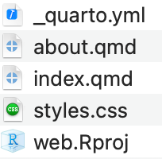

layout: true

<div class="my-footer">
  <span style="text-align:center">
    <span> 
      
    </span>
    <a href="https://therbootcamp.github.io/">
      <span style="padding-left:82px"> 
        <font color="#7E7E7E">
          https://therbootcamp.github.io
        </font>
      </span>
    </a>
    <a href="https://therbootcamp.github.io/">
      <font color="#7E7E7E">
      The R Bootcamp | June 2024
      </font>
    </a>
    </span>
  </div> 

---

```{r setup, include=FALSE}
options(htmltools.dir.version = FALSE)
options(width = 110)
options(digits = 4)

# Load packages
require(tidyverse)
library(leaflet)
library(plotly)

# load color set
source("../../_materials/palette/therbootcamp_palettes.R")

# knitr options
knitr::opts_chunk$set(dpi = 300, echo = FALSE, warning = FALSE, fig.align = 'center', message= FALSE)

# special print function: avoid if possible
print2 <- function(x, nlines=10,...) {
   cat(head(capture.output(print(x,...)), nlines), sep="\n")}

basel <- read_csv("1_data/taxation.csv")

```

# Output formats

.pull-left4[

<ul>
  <li class="m1"><span>Presentations</li> 
  <ul>
    <li><span><high>HTML with reveal.js</high></span></li>
    <li><span>Powerpoint</span></li>  
    <li><span>LaTeX with Beamer</span></li>
  </ul>
  <li class="m2"><span>Websites</span></li> 
  <li class="m3"><span>Manuscripts</span></li> 
    <ul>
    <li><span>HTML </span></li>
    <li><span>Word</span></li>  
    <li><span>LaTeX</span></li>
  </ul>
</ul>

]

.pull-right5[

<br>

<p align = "center">
Screenshot of each product
  <br>
  <font style="font-size:10px">from <a href="https://quarto.org">quarto.org</a></font>
</p>

]

---

# Presentations

.pull-left4[
<high>HTML</high> with reveal.js

<ul>
  <li class="m1"><span>Define <high>Sections</high> and <high>Slides</high> using <mono>#</mono>.</span></li>
</ul>

<table style="cellspacing:0; cellpadding:0; border:none; padding-top:20px" width=100%>
  <col width="40%">
  <col width="60%">
<tr>
  <td bgcolor="white">
    <b>Markdown</b>
  </td>
  <td bgcolor="white">
    <b>Description</b>
  </td> 
</tr>
<tr>
  <td bgcolor="white">
  <mono>#</mono>
  </td>
  <td bgcolor="white">
  Add new <high>section</high>
  </td> 
</tr>
<tr>
  <td bgcolor="white">
  <mono>##</mono>
  </td>
  <td bgcolor="white">
  Add new <high>slide</high>
  </td> 
</tr>
<tr>
  <td bgcolor="white">
  <mono>-</mono>
  </td>
  <td bgcolor="white">
  <high>List</high> item
  </td> 
</tr>
<tr>
  <td bgcolor="white">
  <mono>incremental</mono>
  </td>
  <td bgcolor="white">
  <high>stepwise</high> reveal
  </td> 
</tr>
</table>


]

.pull-right5[

<div style="width:70%">
````markdown
---
title: "Habits"
author: "John Doe"
format: revealjs
---

# Daily routine

## Getting up
- Turn off alarm
- Get out of bed

## Going to sleep
- Get in bed
- Count sheep
````
</div>
<iframe class="slide-deck" src="example_presentations/turn_on.html" width = "70%" ></iframe>

]

---

# Presentations

.pull-left4[
<high>HTML</high> with reveal.js

<ul>
  <li class="m1"><span>Define <high>Sections</high> and <high>Slides</high> using <mono>#</mono>.</span></li>
</ul>

<table style="cellspacing:0; cellpadding:0; border:none; padding-top:20px" width=100%>
  <col width="40%">
  <col width="60%">
<tr>
  <td bgcolor="white">
    <b>Markdown</b>
  </td>
  <td bgcolor="white">
    <b>Description</b>
  </td> 
</tr>
<tr>
  <td bgcolor="white">
  <mono>#</mono>
  </td>
  <td bgcolor="white">
  Add new <high>section</high>
  </td> 
</tr>
<tr>
  <td bgcolor="white">
  <mono>##</mono>
  </td>
  <td bgcolor="white">
  Add new <high>slide</high>
  </td> 
</tr>
<tr>
  <td bgcolor="white">
  <mono>-</mono>
  </td>
  <td bgcolor="white">
  <high>List</high> item
  </td> 
</tr>
<tr>
  <td bgcolor="white">
  <mono>incremental</mono>
  </td>
  <td bgcolor="white">
  <high>stepwise</high> reveal
  </td> 
</tr>
</table>

]

.pull-right5[

<div style="width:70%">
````markdown
---
title: "Habits"
author: "John Doe"
format:
  revealjs:
    incremental: true
---

````
</div>
<iframe class="slide-deck" src="example_presentations/incremental.html" width = "70%" ></iframe>

]

---

# Columns

.pull-left4[

<ul>
  <li class="m1"><span><high>Distribute</high> content with <high>columns</high> <br>defined by fences <mono>::::</mono>.</span></li>
</ul>

<table style="cellspacing:0; cellpadding:0; border:none; padding-top:20px" width=100%>
  <col width="50%">
  <col width="50%">
<tr>
  <td bgcolor="white">
    <b>Markdown</b>
  </td>
  <td bgcolor="white">
    <b>Description</b>
  </td> 
</tr>
<tr>
  <td bgcolor="white">
  <mono><mono>:::: {.column}</mono></mono>
  </td>
  <td bgcolor="white">
  Add <high>columns</high>
  </td> 
</tr>
<tr>
  <td bgcolor="white">
  <mono>::: {.column width="XX%"}</mono>
  </td>
  <td bgcolor="white">
  Set column <high>width</high>
  </td> 
</tr>

</table>

]

.pull-right5[

<div style="width:70%">
````markdown
:::: {.columns}
::: {.column width="40%"}
Left column
- Turn off alarm
- Get out of bed
:::

::: {.column width="60%"}
Right column

- Get in bed
- Count sheep
:::
::::

````
</div>
<iframe class="slide-deck" src="example_presentations/columns.html" width = "70%" ></iframe>

]

---

# Speaker notes

.pull-left4[

<ul>
  <li class="m1"> <span>Add Speaker <high>notes</high> with <mono>{.notes}</mono></span></li> 
  <li class="m2"><span>Press <mono>S</mono> for <high>presentation view</high>.</span></li> 

</ul>

]

.pull-right5[

<div style="width:70%">
````markdown
## Slide with speaker notes

Slide content

::: {.notes}
Speaker notes go here.
:::

````
</div>
<br>

]

---

# Footer & Logo

.pull-left4[

Add information on <high> each slide</high>.

<ul>
  <li class="m1"><span><high>Footer</high> text </span></li> 
  <li class="m2"><span><high>Logo<Logo></span></li> 
  <li class="m3"><span><high>Custom footer</high> per slide with <br><mono>footer</mono></span></li> 

</ul>

]

.pull-right5[

<div style="width:70%">
````markdown
---
format:
  revealjs:
    logo: logo.png
    footer: "University of Bern"
---

````
</div>
<iframe class="slide-deck" src="example_presentations/footer.html" width = "70%" ></iframe>

]

---

# Footer & Logo

.pull-left4[

Add information on <high> each slide</high>.

<ul>
  <li class="m1"><span><high>Footer</high> text </span></li> 
  <li class="m2"><span><high>Logo<Logo></span></li> 
  <li class="m3"><span><high>Custom footer</high> per slide with <br><mono>footer</mono></span></li> 

</ul>

]

.pull-right5[

<div style="width:70%">
````markdown

---
format:
  revealjs:
    logo: logo.png
    footer: "University of Bern"
---
...

::: footer
Custom footer text
:::

````
</div>
<iframe class="slide-deck" src="example_presentations/footer_custom.html" width = "70%" ></iframe>

]

---

# Presentations

.pull-left4[
<high>Power Point</high>

<ul>
  <li class="m1"><span>Define <high>Sections</high> and <high>Slides</high> using <mono>#</mono>.</span></li>
</ul>

<table style="cellspacing:0; cellpadding:0; border:none; padding-top:20px" width=100%>
  <col width="40%">
  <col width="60%">
<tr>
  <td bgcolor="white">
    <b>Markdown</b>
  </td>
  <td bgcolor="white">
    <b>Description</b>
  </td> 
</tr>
<tr>
  <td bgcolor="white">
  <mono>#</mono>
  </td>
  <td bgcolor="white">
  Add new <high>section</high>
  </td> 
</tr>
<tr>
  <td bgcolor="white">
  <mono>##</mono>
  </td>
  <td bgcolor="white">
  Add new <high>slide</high>
  </td> 
</tr>
<tr>
  <td bgcolor="white">
  <mono>-</mono>
  </td>
  <td bgcolor="white">
  <high>List</high> item
  </td> 
</tr>
<tr>
  <td bgcolor="white">
  <mono>incremental</mono>
  </td>
  <td bgcolor="white">
  <high>stepwise</high> reveal
  </td> 
</tr>
</table>


]

.pull-right5[

<div style="width:70%">
````markdown
---
title: "Habits"
author: "John Doe"
format: pptx
---

# Daily routine

## Getting up
- Turn off alarm
- Get out of bed

## Going to sleep
- Get in bed
- Count sheep
````
</div>
<p align = "center">

</p>

]


---

# Presentations

.pull-left4[
<high>Power Point</high>

<ul>
  <li class="m1"><span>Define <high>Sections</high> and <high>Slides</high> using <mono>#</mono>.</span></li>
</ul>

<table style="cellspacing:0; cellpadding:0; border:none; padding-top:20px" width=100%>
  <col width="40%">
  <col width="60%">
<tr>
  <td bgcolor="white">
    <b>Markdown</b>
  </td>
  <td bgcolor="white">
    <b>Description</b>
  </td> 
</tr>
<tr>
  <td bgcolor="white">
  <mono>#</mono>
  </td>
  <td bgcolor="white">
  Add new <high>section</high>
  </td> 
</tr>
<tr>
  <td bgcolor="white">
  <mono>##</mono>
  </td>
  <td bgcolor="white">
  Add new <high>slide</high>
  </td> 
</tr>
<tr>
  <td bgcolor="white">
  <mono>-</mono>
  </td>
  <td bgcolor="white">
  <high>List</high> item
  </td> 
</tr>
<tr>
  <td bgcolor="white">
  <mono>incremental</mono>
  </td>
  <td bgcolor="white">
  <high>stepwise</high> reveal
  </td> 
</tr>
</table>


]

.pull-right5[

<div style="width:70%">

</div>
<p align = "center">
  
</p>

]


---


# Websites

.pull-left4[

<ul>
  <li class="m1"><span><high>New Project</high></span></li> 
  <li class="m2"><span><high>Quarto Website</high> a new folder <mono>_site</mono></span></li>
</ul>

]

.pull-right5[

<p align = "center">
  
</p>


]

---

# Websites

.pull-left4[
A <high>set of files</high> is automatically generated in the <high>new folder</high>.
<ul>
  <li class="m1"><span><mono>.qmd</mono> with <high>Text</high></span></li> 
  <li class="m2"><span><mono>.css</mono> <high>Style</high></span></li> 
  <li class="m3"><span><mono>.yml</mono> YAML <high>config file</high></span></li> 
</ul>

]

.pull-right5[

<p align = "center">
  
</p>

]

---


# <mono>_quarto.yml</mono> config file

.pull-left4[

Global information for the <high>website configuration</high>.
<ul>
  <li class="m1"><span><mono>navbar</mono> sets <high>location</high> and <high>content</high> of navigation</span></li> 
  <li class="m2"><span><mono>theme, css</mono> <high>define layout</high></span></li> 
    <li class="m3"><span><mono>toc</mono> adds <high>table of contents<high></span></li>

</ul>

]

.pull-right5[

````markdown

project:
  type: website

website:
  title: "Our UniBE website"
  navbar:
    left:
      - href: index.qmd
        text: Home
      - about.qmd

format:
  html:
    theme: cosmo
    css: styles.css
    toc: true
    
````

]

---

# <mono>_quarto.yml</mono> config file

.pull-left4[

Global information for the <high>website configuration</high>.
<ul>
  <li class="m1"><span><mono>navbar</mono> sets <high>location</high> and <high>content</high> of navigation</span></li> 
  <li class="m2"><span><mono>theme, css</mono> <high>define layout</high></span></li> 
    <li class="m3"><span><mono>toc</mono> adds <high>table of contents<high></span></li>

</ul>

]

.pull-right5[

<iframe src="example_website/web/_site/index.html" width="500" height="400"></iframe>

]

---

# Websites

.pull-left4[
A <high>set of files</high> is automatically generated in the <high>new folder</high>.
<ul>
  <li class="m1"><span><mono>.html</mono> with <high>Text</high></span></li> 
  <li class="m2"><span><mono>.css</mono> <high>Style</high></span></li> 
  <li class="m3"><span><mono>.json</mono> <high>Search </high> capabilities</span></li> 
</ul>

]

.pull-right5[

<p align = "center">
  
</p>

]


---

class: middle, center

<h1><font style="font-size:12px">click to open</font><br><a href="https://therbootcamp.github.io/DataViz_2022GSERM/_sessions/markdown/markdown_report.html">Practical</a></h1>


