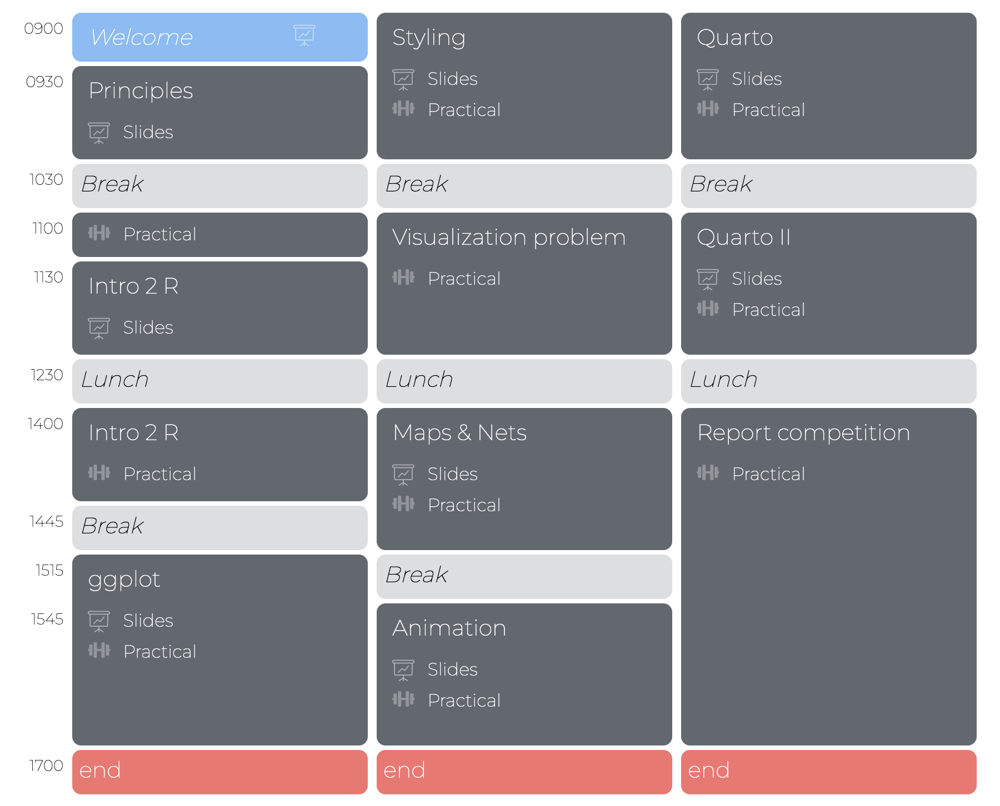
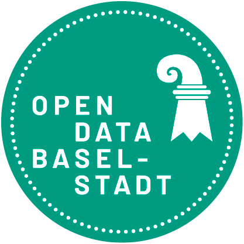
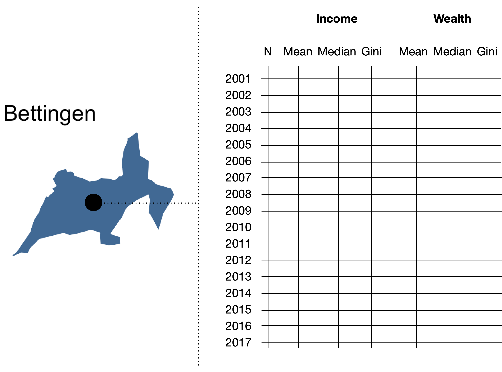
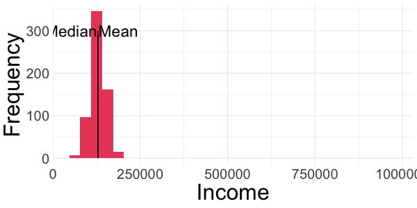
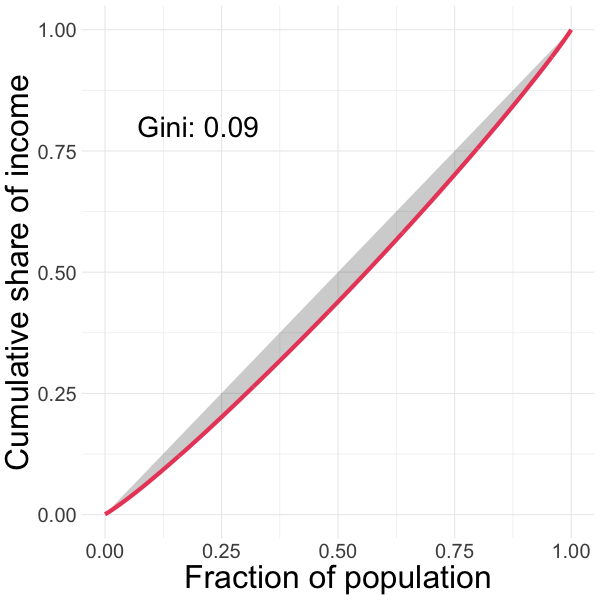
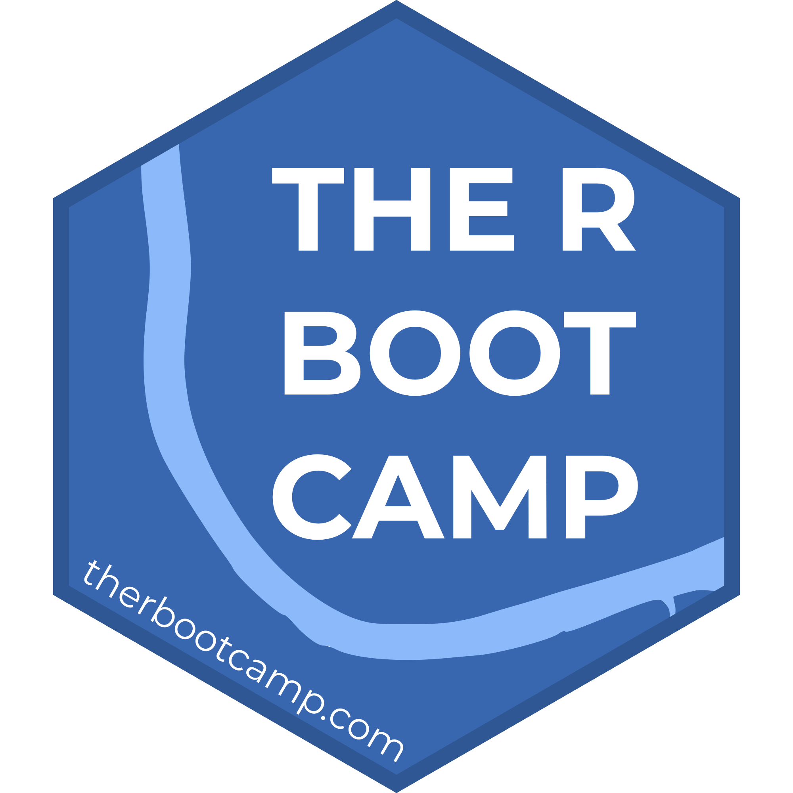

layout: true

<div class="my-footer">
  <span style="text-align:center">
    <span> 
      
    </span>
    <a href="https://therbootcamp.github.io/">
      <span style="padding-left:82px"> 
        <font color="#7E7E7E">
          https://therbootcamp.github.io
        </font>
      </span>
    </a>
    <a href="https://therbootcamp.github.io/">
      <font color="#7E7E7E">
      The R Bootcamp | June 2024
      </font>
    </a>
    </span>
  </div> 

---


```{r setup, include=FALSE}
options(htmltools.dir.version = FALSE)
options(width=110)
options(digits = 4)

knitr::opts_chunk$set(fig.align = 'center')
```

<!---

.pull-left45[
<br><br><br><br><br>
# Materialien

Klicke auf <high>"....running..."</high> auf unserer Website!

<font style="font-size:28px"><a href="www.therbootcamp.com"><b>www.therbootcamp.com</b></a></font>

]

.pull-right5[

<br><br>
<iframe src="https://therbootcamp.github.io" width="500" height="500"></iframe>

]

--->

.pull-left6[

<br><br><br><br><br>


# Goal


>### The goal of this workshop is to introduce you to R's tools for data visualization and communication and how they can be used to effectively communicate insights from data!

]

.pull-right4[

<br><br><br><br>
<p align="center"></p>

]


---

.pull-left45[

<br>
# Schedule 

<ul>
  <li class="m1"><span>Core of the workshop consists of 8 sessions on <high>R and visualization</high>. Each session is structured into:</span></li>
  <ul class="level">
    <li><span>30-45min introduction</high></span></li> 
    <li><span>30-45min coding exercises</span></li> 
    <li><span>5-10min Q&A</span></li> 
  </ul>
  <li class="m2"><span>Additional sessions to advance your visualization skills and a final, big <high>competition</high> with <high>prizes</high>.</span></li>
</ul>

]

.pull-right5[
<br><br><br>


]

---

.pull-left3[

# Inequality in Basel

<font style="font-size:28px"><high><i class="far fa-question-circle"></i></high> How has the distribution of income and wealth changed within and between Basel's quarters from 2001 and 2017?</i></font>

<br>

<p align="center">

</p>

]

.pull-right6[

<br>

<p align="center">

</p>

]

---

.pull-left3[

# Inequality in Basel

<font style="font-size:28px"><high><i class="far fa-question-circle"></i></high> How has the distribution of income and wealth changed within and between Basel's quarters from 2001 and 2017?</i></font>

<br>

<p align="center">

</p>

]

.pull-right6[

<br>

<p align="center">

</p>

]


---

.pull-left3[

# Mean, Median, Gini

<ul>
  <li class="m1"><span>Inequality arising from a <high>rich-get-richer</high> dynamic materializes as an increasingly right-skewed income distribution.</span></li><br>
  <li class="m2"><span>This can be detected:</span></li><br>
  <ul class="level">
    <li><span><high>Mean</high> income grows faster than <high>median</high> income.</span></li><br>
    <li><span>The <high>Gini</high> coefficient goes up.</span></li>
  </ul>
</ul>

]


.pull-right65[
<br>
<p align="center">
<br>

</p>
]

---

.pull-left3[

# Mean, Median, Gini

<ul>
  <li class="m1"><span>Inequality arising from a <high>rich-get-richer</high> dynamic materializes as an increasingly right-skewed income distribution.</span></li><br>
  <li class="m2"><span>This can be detected:</span></li><br>
  <ul class="level">
    <li><span><high>Mean</high> income grows faster than <high>median</high> income.</span></li><br>
    <li><span>The <high>Gini</high> coefficient goes up.</span></li>
  </ul>
</ul>

]


.pull-right65[
<br>
<p align="center">
<br>

</p>
]


---

# Who are we?

<table class="tg"  style="cellspacing:0; cellpadding:0; border:none">
  <col width="22%">
  <col width="22%">
  <col width="22%">
  <tr>
    <th class="tg-yw4l" valign='top'>
    <p align="center">
    <a href="www.dirkwulff.org"></a><br>
    <p align="center">
    <font size = 5>Dr. Dirk Wulff</font><br><br><br>
    <a href="www.dirkwulff.org"><b>dirkwulff.org</b></a><br>
    <a href="https://github.com/dwulff"><b>github.com/dwulff</b></a><br>
    <font size=4><i>packages: </i></font> 
    <a href="https://cran.r-project.org/web/packages/text2sdg/index.html"><b>text2sdg</b></a>, <a href="https://cran.r-project.org/web/packages/cstab/index.html"><b>cstab</b></a>, <br>
    <a href="https://cran.r-project.org/web/packages/mousetrap/index.html"><b>mousetrap</b></a>, <a href="https://cran.r-project.org/web/packages/memnet/index.html"><b>memnet</b>, <a href="https://github.com/dwulff/choicepp"><b>choicepp</b>
    </p>  
  </th>
  
  <th class="tg-yw4l" valign='top'>
    <p align="center">
    <a href="https://www.schulte-mecklenbeck.com/"></a><br>
    <p align="center">
    <font size = 5>Prof. Dr. Michael<br>Schulte-Mecklenbeck</font><br><br>
    <a href="www.schulte-mecklenbeck.com"><b>schulte-mecklenbeck.com</b></a><br>
    <a href="https://github.com/schultem"><b>github.com/schultem</b></a><br><br>
    </p>
  </th>
  
  <th class="tg-yw4l" valign='top'>
    <p align="center">
    <a href="https://therbootcamp.github.io/"></a><br>
    <p align="center">
    <font size = 5>The R Bootcamp</font><br><br><br>
    <a href="https://therbootcamp.github.io/"><b>therbootcamp.github.io</b></a><br>
    </p>
  </th>


</tr>

</table>


---

# Who you are?

.pull-left35[

<ul>
  <li class="m1"><span>In three sentences:</span></li><br>
  <ul class="level">
  <li><span>Who are you?</span></li><br>
  <li><span>How much experience do you have with R?</span></li><br>
  <li><span>What do you want to learn about data visualization?</span></li>
  </ul>
</ul>

]

.pull-right55[

<p align="center">

<br>
<font style="font-size:10px">from <a href="https://unsplash.com/photos/3MYvgsH1uK0">unsplash.com</a></font>
</p>

]

---

class: middle, center

<h1><a href="https://therbootcamp.github.io/DataViz_2024Bern/">Schedule</a></h1>


